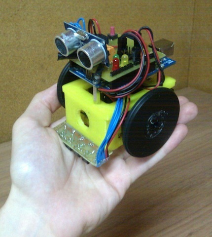
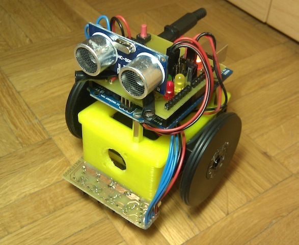
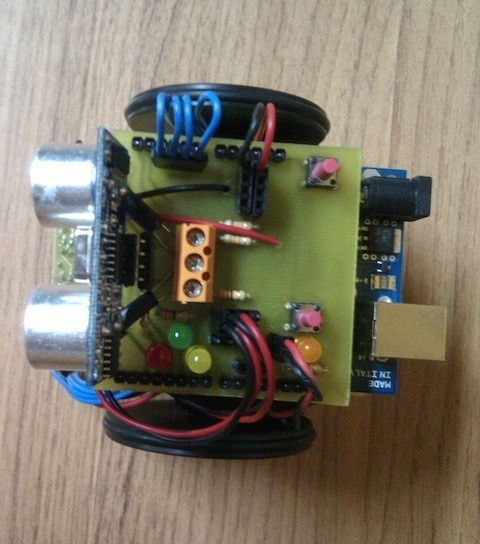
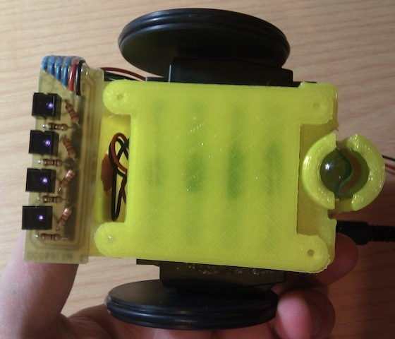
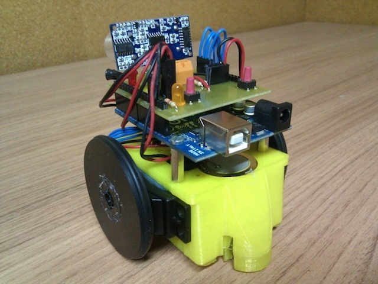
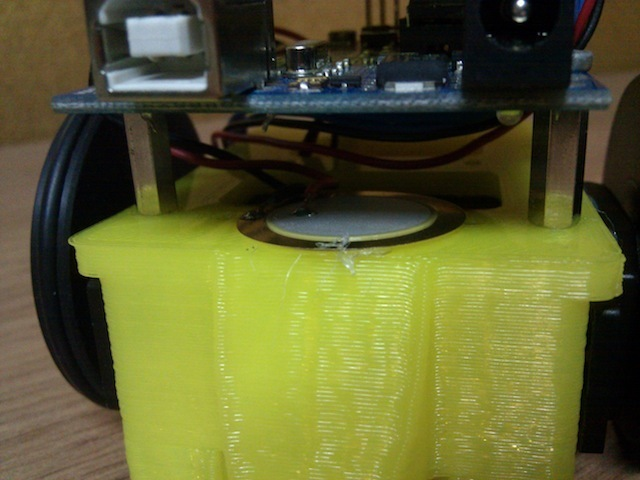
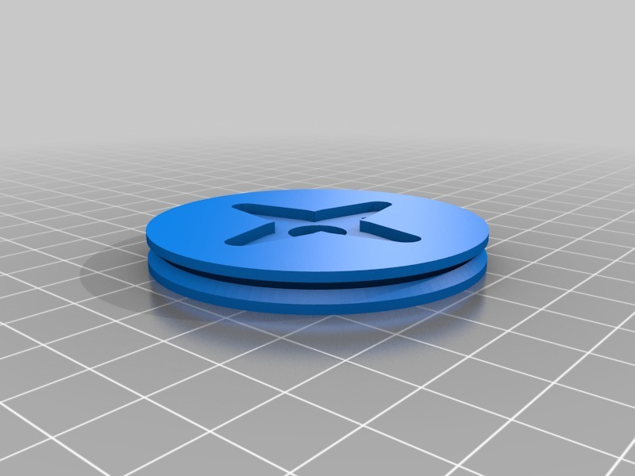
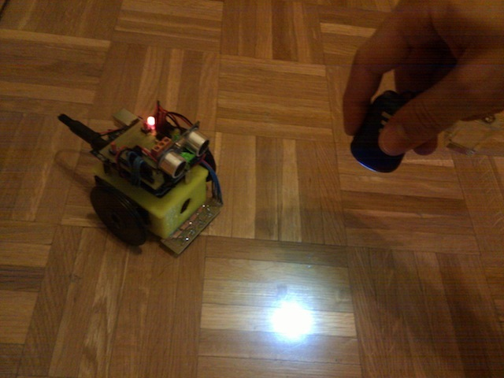
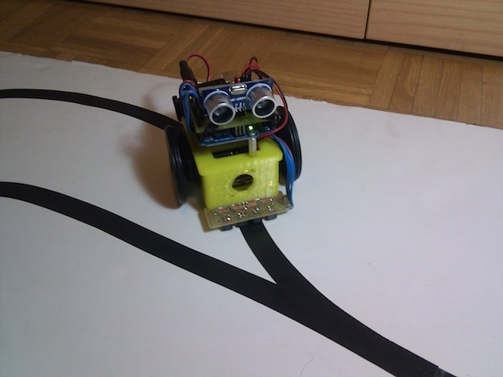
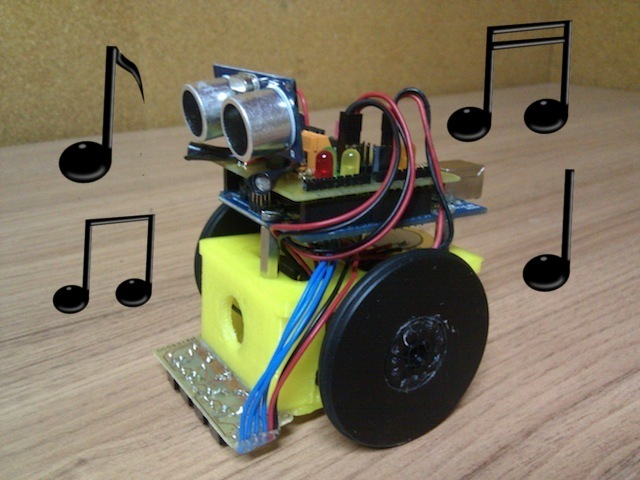

ArduSkyBot v1.0, an open source educational printbot
===============
**Please note: This list has been automatically generated. Some of the designs have been updated since then, and already have they own GitHub page.**  

ArduSkyBot v1.0, an open source educational printbot [Git repo]  by carlosgs , published Jul 18, 2012

Description
--------
Download (Git): **Now all the files are hosted in GitHub:** <a href="https://github.com/carlosgs/ArduSkybot" target="_blank" rel="nofollow">github.com/carlosgs/ArduSkybot</a>  
==   
 
VIDEO: You can see the robot being used in the 2012 Summer Workshop:   
<a href="http://www.youtube.com/watch?v=2o3PmDZZxAQ" target="_blank" rel="nofollow">youtube.com/watch?v=2o3PmDZZxAQ</a>  
 
Remember the MiniSkyBot? It just got better!   
Using an Arduino UNO, the Printshield and CNY70-board it has all these features:   
- Ultrasonic distance sensor   
- Two light sensors   
- Line sensor   
- Two buttons   
- Four LEDs   
- Piezoelectric speaker   

Instructions
--------
1) Print MiniSkyBot chassis and wheels (note: you will need 6 AAA batteries instead of 4, I use a separate two battery holder) 
2) Make a Printshield (http://www.thingiverse.com/thing:26816) and a CNY70-board (http://www.thingiverse.com/thing:26819) 
3) Trick two servos for continuous rotation (http://www.acroname.com/robotics/info/ideas/continuous/continuous.html KEEPING THE INTERNAL ELECTRONICS!). 
4) Assemble everything. You can place the piezoelectric speaker behind the board, stuck to the chassis. 
5) Program and enjoy :) 
 
More info (slides and testing code) here: <a href="http://carlosgs.es/2012-summer-workshop" target="_blank" rel="nofollow">carlosgs.es/2012-summer-workshop</a> 
 
Lots of ideas taken from: 
- MiniSkyBot 2.0 by Obijuan <a href="http://www.thingiverse.com/thing:7989" target="_blank" rel="nofollow">thingiverse.com/thing:7989</a> 
- HKTR-9000 <a href="http://www.thingiverse.com/thing:23593" target="_blank" rel="nofollow">thingiverse.com/thing:23593</a>

Files
--------

 [ MiniSkyBot_Servo-wheel-4-arm-horn.stl](MiniSkyBot_Servo-wheel-4-arm-horn.stl)  

Pictures
--------

Tags
--------
arduino , button , distance , LDR , light , pcb , plastic_valley , printbot , robot , sensor , shield , UAM , ultrasonic  

Author: Carlos Garcia Saura (carlosgs)
--------
<http://carlosgs.es/>  

License
--------
ArduSkyBot v1.0, an open source educational printbot [Git repo] by carlosgs is licensed under the Creative Commons - Attribution - Share Alike license.  

