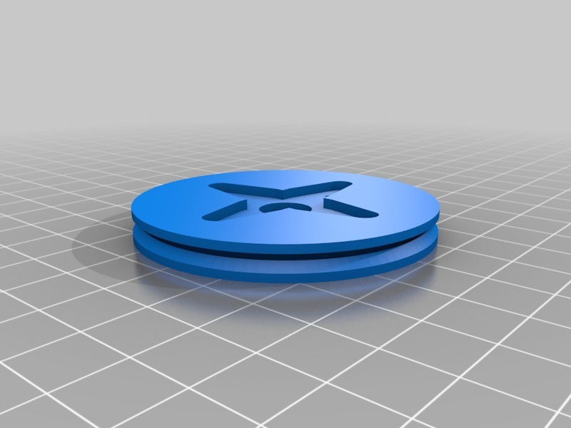

ArduSkyBot v2.0
===============
**Please note: This thing is part of a list that was [automatically generated](https://github.com/carlosgs/export-things) and may have been updated since then. Some already have [their own GitHub page!](https://github.com/carlosgs?tab=repositories). Make sure to check for the current license and authorship.**  

ArduSkyBot v2.0 [Git repo]  by carlosgs , published Sep 29, 2012

Description
--------
Download (Git): **Now all the files are hosted in GitHub:** <a href="https://github.com/carlosgs/ArduSkybot" target="_blank" rel="nofollow">github.com/carlosgs/ArduSkybot</a>  
==   
 
VIDEO: You can see the robot being used in the 2012 Summer Workshop:   
<a href="http://www.youtube.com/watch?v=2o3PmDZZxAQ" target="_blank" rel="nofollow">youtube.com/watch?v=2o3PmDZZxAQ</a>  
 
New version of the ArduSkuBot.   
Using an Arduino UNO, the Printshield and CNY70-board it has all these features:   
- Ultrasonic distance sensor   
- Two light sensors   
- Line sensor   
- Two buttons   
- Four LEDs   
- Piezoelectric speaker

Instructions
--------
1) Print MiniSkyBot chassis and wheels. 
2) Make a Printshield (http://www.thingiverse.com/thing:26816) and a CNY70-board (http://www.thingiverse.com/thing:26819) 
3) Assemble everything (tutorial: <a href="http://carlosgs.es/sites/default/files/2012%20Lesson%202%20-%20Assembling%20the%20ArduSkyBot.pdf" target="_blank" rel="nofollow">carlosgs.es/sites/default/files/2012%20Lesson%202%20-%20Assembling%20the%20ArduSkyBot.pdf</a>) 
4) Program and enjoy :) 
 
More info (slides and testing code) here: <a href="http://carlosgs.es/2012-summer-workshop" target="_blank" rel="nofollow">carlosgs.es/2012-summer-workshop</a> 
 
<b>Lots of ideas taken from:</b> 
- MiniSkyBot 2.0 by Obijuan <a href="http://www.thingiverse.com/thing:7989" target="_blank" rel="nofollow">thingiverse.com/thing:7989</a> 
- HKTR-9000 <a href="http://www.thingiverse.com/thing:23593" target="_blank" rel="nofollow">thingiverse.com/thing:23593</a> 
 
<b>TO-DO:</b> 
- New version of the Printshield, adding IR receiver and protection diode for the servos. 
- Better demo code 
- Better documentation 
 

Files
--------

 [ Servo-wheel-4-arm-horn.stl](Servo-wheel-4-arm-horn.stl)  

Pictures
--------

Tags
--------
arduino , button , distance , LDR , light , pcb , plastic_valley , printbot , printshield , robot , sensor , shield , UAM , ultrasonic  

  

License
--------
ArduSkyBot v2.0 [Git repo] by carlosgs is licensed under the Creative Commons - Attribution - Share Alike license.  

By: Carlos Garcia Saura (carlosgs)
--------
<http://carlosgs.es/>