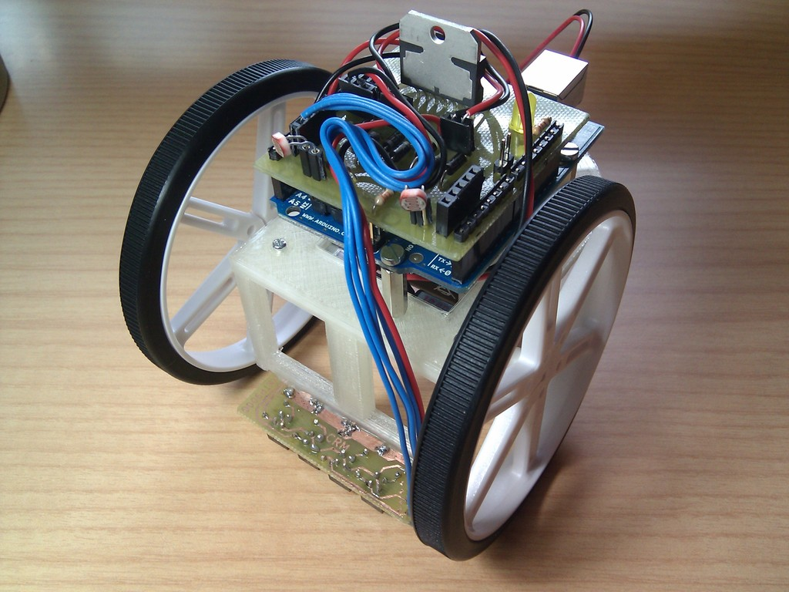
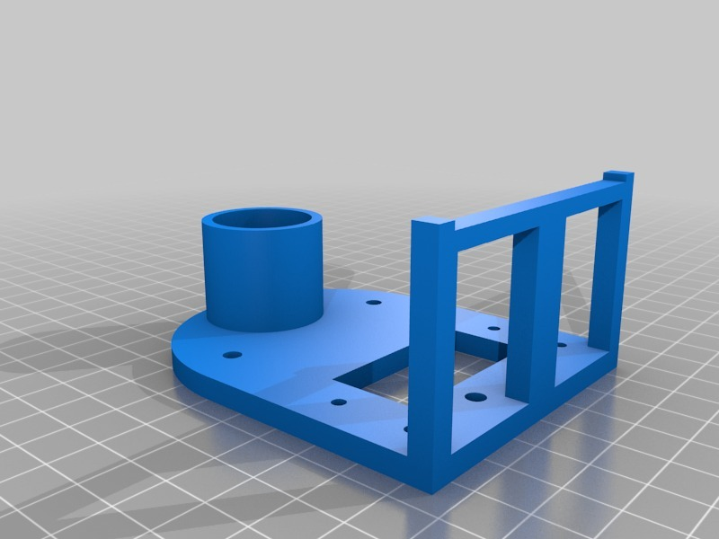
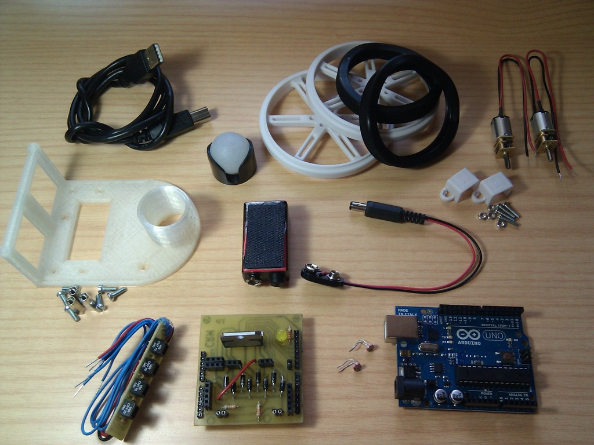
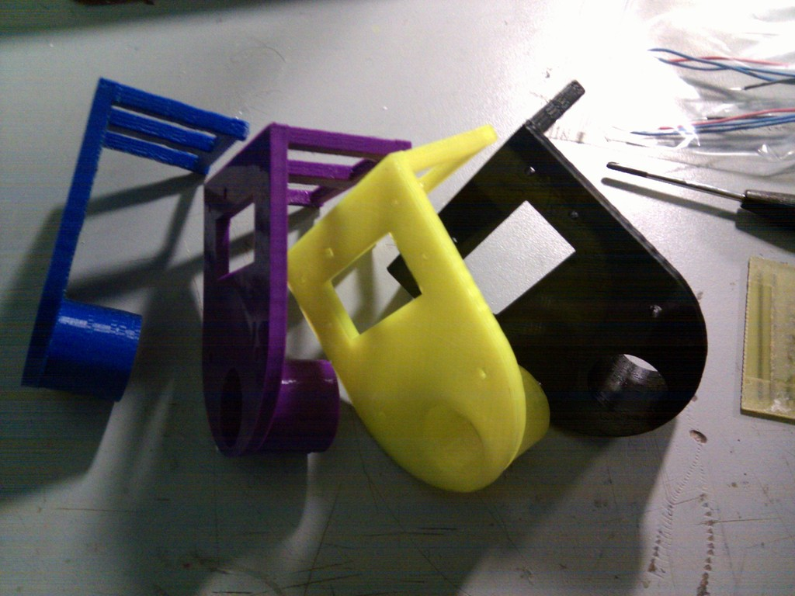
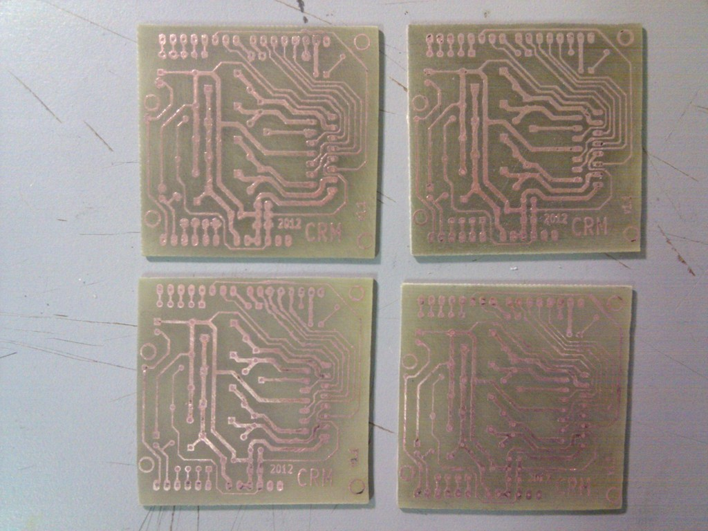
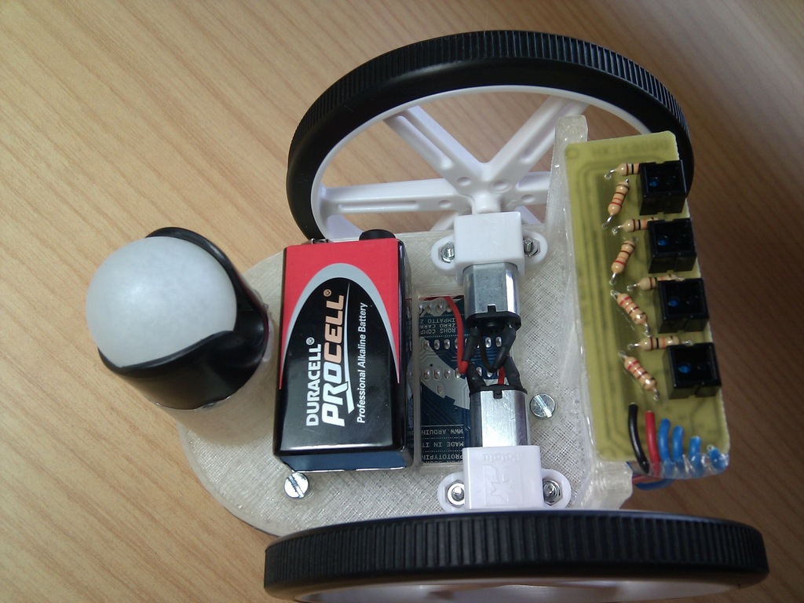
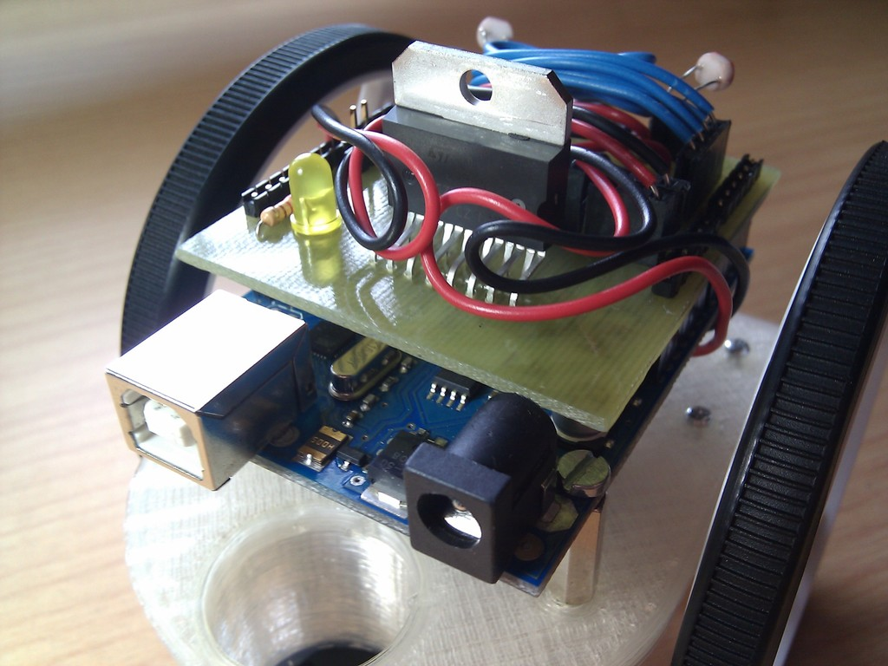

Arduino based printbot HKTR-9000
===============
Arduino based printbot HKTR-9000  by carlosgs , published May 23, 2012

Description
--------
Simple educational robot for learning how to use various sensors (light, line, distance...) with Arduino UNO. 
 
It features the CRM-Shield and a four-CNY70 board for reading a line on the floor.

Instructions
--------
Main features: 
- Two Pololu micro-motors with Pololu wheels 
- Pololu Ball caster 
- Arduino UNO with CRM-Shield (which has L298 motor driver, two LDR sensors and one LED). 
- Four-CNY70 board 
- <b>This shield and CNY70 boards are very likely to be used in other printbots :)</b> 
- 9V battery that connects to Arduino's power connector 
- Main body is 3D printable, based on the MiniSkybot by Obijuan (http://www.thingiverse.com/thing:7989) 
 
Designed in the "Club de Robótica-Mecatrónica, Universidad Autónoma de Madrid" by: 
- Carlos García Saura 
- Lucas Polo López 
 
This wouldn't have been posible without help from: 
- Juan González Gómez (Obijuan) 
- Miguel Gargallo Vázquez 
- Álvaro Pérez Ortega 
 
Videos: 
Robotics introductory workshop at EPS-UAM (Madrid, Spain): <a href="http://www.youtube.com/watch?v=jGQRYJm-Wq0" target="_blank" rel="nofollow">youtube.com/watch?v=jGQRYJm-Wq0</a> 
 

Files
--------

 [ CNY70_board.zip](CNY70_board.zip)  

 [ Shield_CRM_L298_v1.1.zip](Shield_CRM_L298_v1.1.zip)  

 [ Chasis_source.zip](Chasis_source.zip)  

 [ Chasis.stl](Chasis.stl)  

Pictures
--------

Tags
--------
Arduino , CRM , kicad , pcb , pin_header , plastic_valley , printbot , shield , UAM  

Author: Carlos Garcia Saura (carlosgs)
--------

License
--------
Arduino based printbot HKTR-9000 by carlosgs is licensed under the Creative Commons - Attribution - Share Alike license.  

