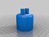
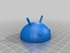
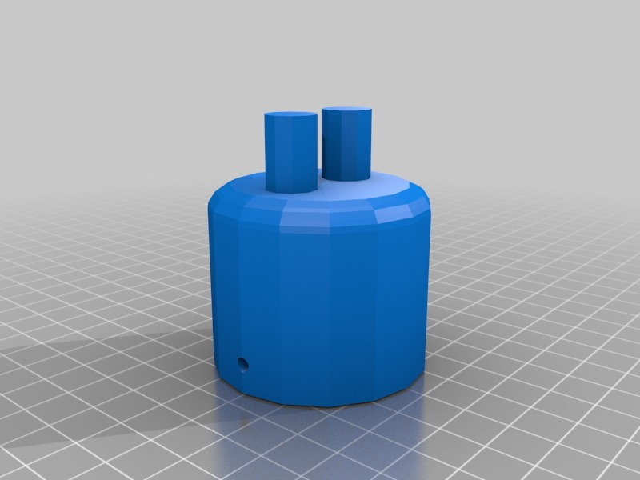

Better-hinged Google Android
===============
**Please note: This list has been automatically generated. Some of the designs have been updated since then, and already have they own GitHub page.**  
Better-hinged Google Android  by carlosgs , published Jun 29, 2012

Description
--------
After printing the original Android (thing 1902), I added holes with OpenScad, so now it is possible to use 3mm plastic filament to create hings that are actually flexible and sturdy :)

Instructions
--------
Print, cut some pieces of 3mm plastic filament, assemble and have fun! 
 
I suggest adding a washer in the neck, so there is some spacing like in the original android.

Files
--------

 [ android_head.scad](android_head.scad)  

 [ android_arm2.stl](android_arm2.stl)  

 [ android_body.scad](android_body.scad)  

 [ android_body2.stl](android_body2.stl)  

 [ android_arm.scad](android_arm.scad)  

 [ android_head2.stl](android_head2.stl)  

Pictures
--------

Tags
--------
plastic_valley , uam  

Author: Carlos Garcia Saura (carlosgs)
--------
<http://carlosgs.es/>  

License
--------
Better-hinged Google Android by carlosgs is licensed under the Creative Commons - Attribution - Share Alike license.  

