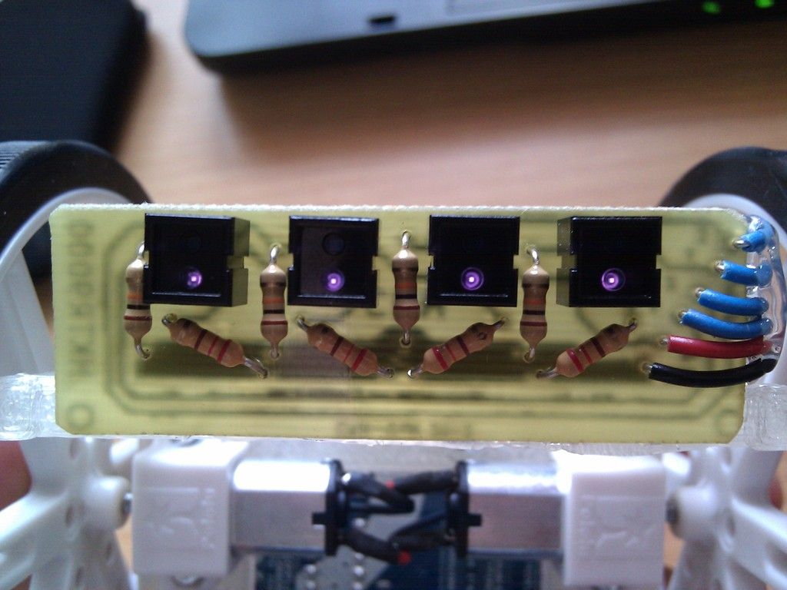
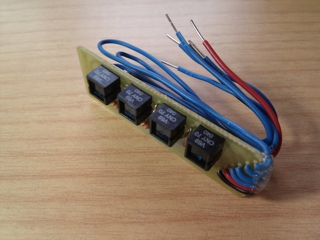
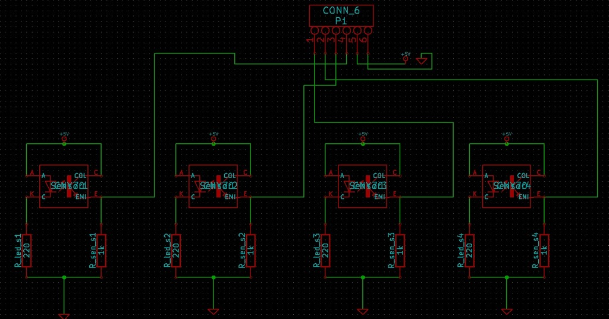
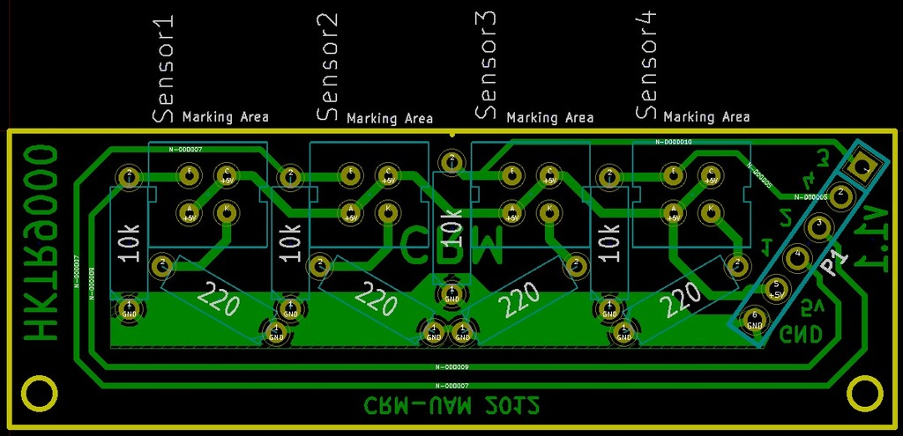

CNY70 sensor array for printbots
===============
**Please note: This list has been automatically generated. Some of the designs have been updated since then, and already have they own GitHub page.**  
CNY70 sensor array for printbots [Git repo]  by carlosgs , published Jul 18, 2012

Description
--------
Download (Git): **Now all the files are hosted in GitHub:** <a href="https://github.com/carlosgs/ArduSkybot/tree/master/Electronics" target="_blank" rel="nofollow">github.com/carlosgs/ArduSkybot/tree/master/Electronics</a>  
==   
 
Easy to make, one side circuit board for using with Printbots like the ArduSkyBot or the HKTR-9000 :)   
 
Update 1.1: Added component values to the schematic. Thanks to Martin Velickovski for the note!

Instructions
--------
You can use one of this methods to make the PCB: 
<a href="http://www.youtube.com/watch?v=QQupRXEqOz4" target="_blank" rel="nofollow">youtube.com/watch?v=QQupRXEqOz4</a> 
<a href="http://www.instructables.com/id/Toner-transfer-no-soak-high-quality-double-sided/" target="_blank" rel="nofollow">instructables.com/id/Toner-transfer-no-soak-high-quality-double-sided/</a> (this one didn't work for me, you should try it anyway...) 
 
Designed with Kicad

Files
--------

 [ placa_cny70-Back.pdf](placa_cny70-Back.pdf)  

Pictures
--------

Tags
--------
arduino , CNY70 , line , pcb , plastic_valley , printbot , robot , sensor , shield , UAM  

Author: Carlos Garcia Saura (carlosgs)
--------
<http://carlosgs.es/>  

License
--------
CNY70 sensor array for printbots [Git repo] by carlosgs is licensed under the Creative Commons - Attribution - Share Alike license.  

