Canon EOS 350D model
===============
**Please note: This thing is part of a list that was [automatically generated](https://github.com/carlosgs/export-things) and may have been updated since then. Make sure to check for the current license and authorship.**  

Canon EOS 350D model  by carlosgs , published Jun 21, 2012

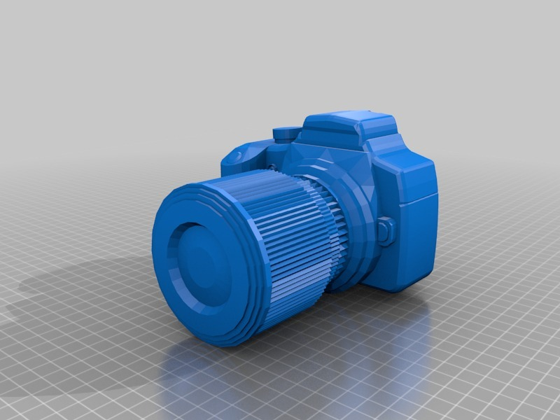

Description
--------
I found this great Sketchup design by ALX: <a href="http://sketchup.google.com/3dwarehouse/details?mid=112d9018c88671703fdfd6bc6322f73b&amp;prevstart=0" target="_blank" rel="nofollow">sketchup.google.com/3dwarehouse/details?mid=112d9018c88671703fdfd6bc6322f73b&amp;prevstart=0</a> 
So I exported it to STL, adapted the (approximate) real size scale, and printed the model :)

Instructions
--------
1) Print the numbered parts (I used black ABS and there was some wrapping, it is better to use PLA) 
2) Fix them with glue (a glue gun works well) 
3) If you have good drawing hand try to paint the letters so it looks more real :) 
 
 
Thanks to ALX for the original desing and to Juan Gonzlez Gmez who helped slicing the parts. 
 
Printed on a custom Printrbot :) 
 
<a href="http://www.carlosgs.es/" target="_blank" rel="nofollow">carlosgs.es/</a>

Files
--------
[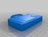](1_body_fixed.stl)
 [ 1_body_fixed.stl](1_body_fixed.stl)  

[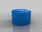](4_lens_fixed.stl)
 [ 4_lens_fixed.stl](4_lens_fixed.stl)  

[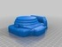](2_body_fixed.stl)
 [ 2_body_fixed.stl](2_body_fixed.stl)  

 [ Canon350Dbasic_byALX_original.skp](Canon350Dbasic_byALX_original.skp)  

[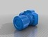](Canon350DbasicbyALX_fixed.stl)
 [ Canon350DbasicbyALX_fixed.stl](Canon350DbasicbyALX_fixed.stl)  

[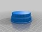](3_lens_fixed.stl)
 [ 3_lens_fixed.stl](3_lens_fixed.stl)  

Pictures
--------
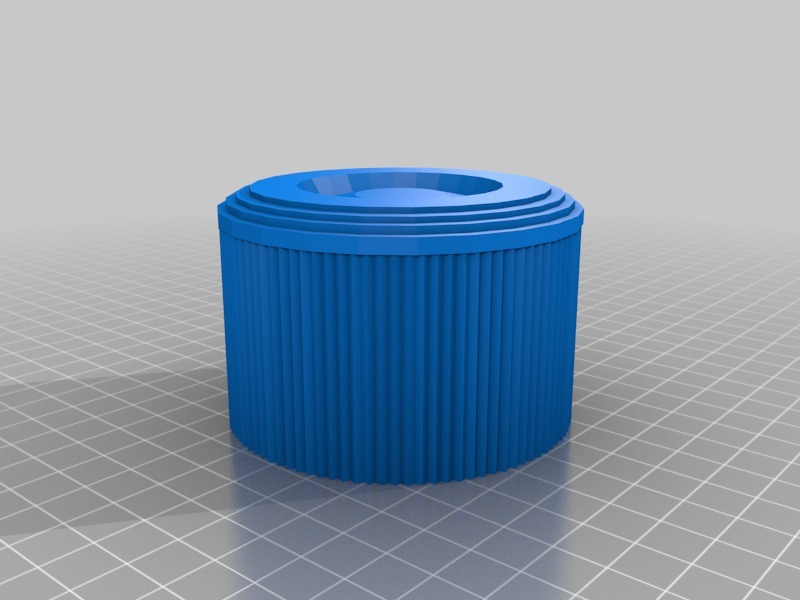
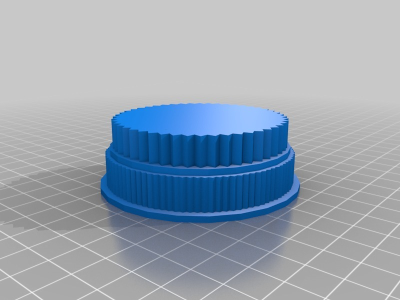

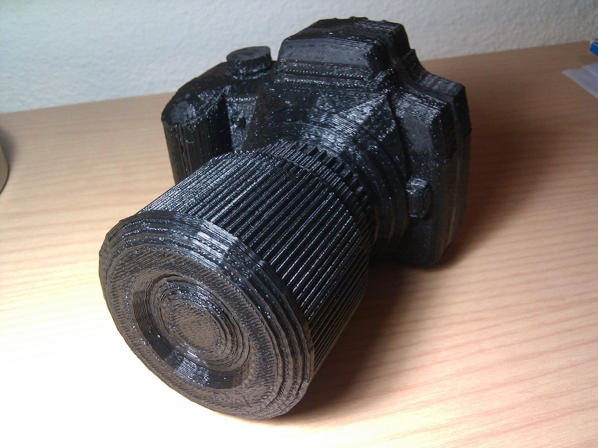
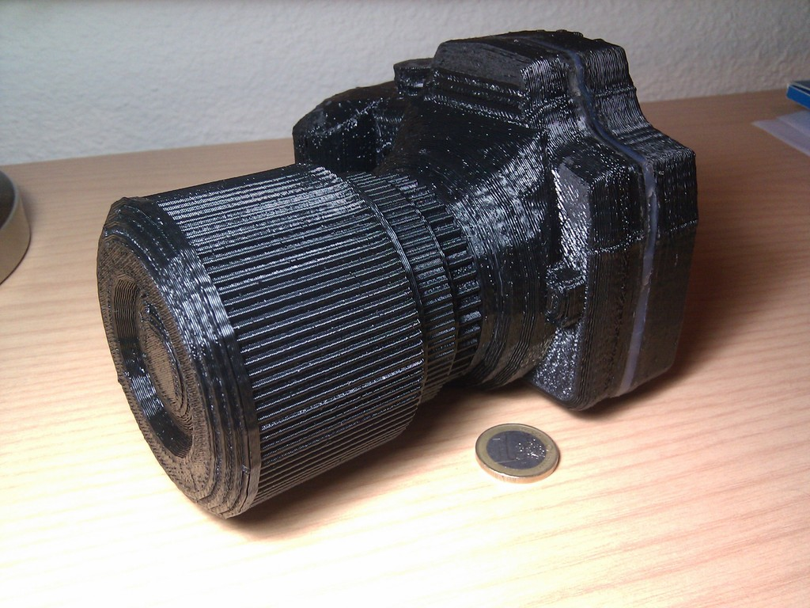
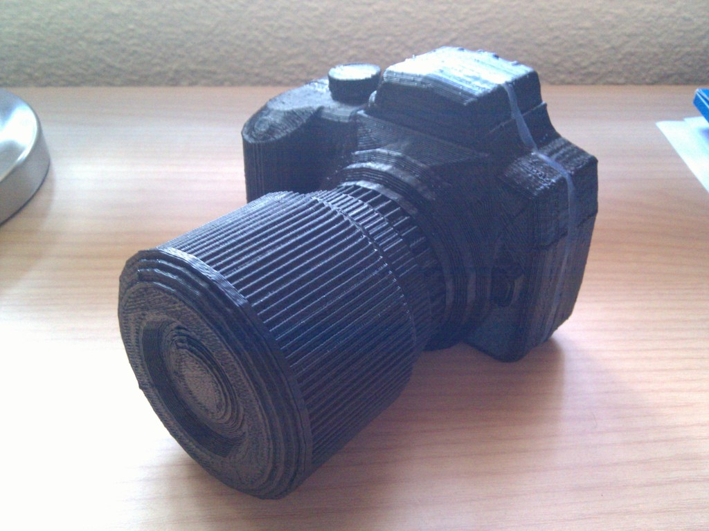
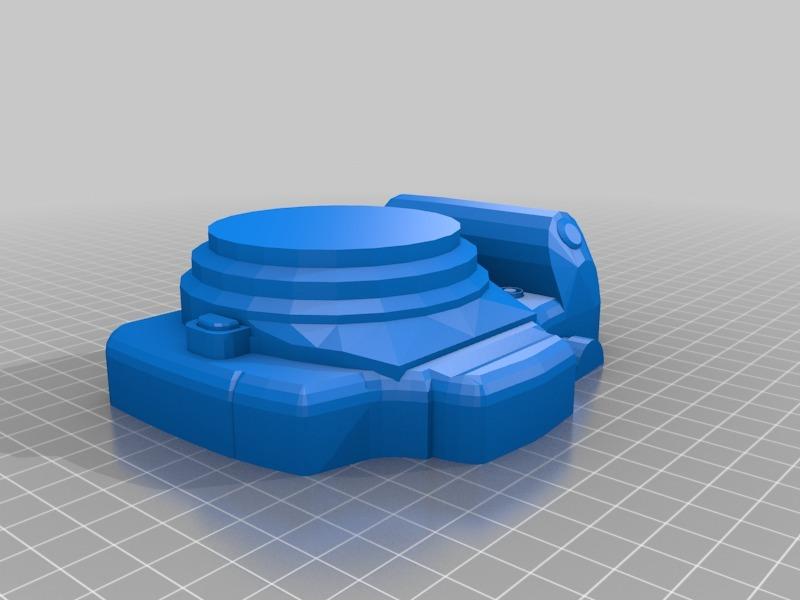
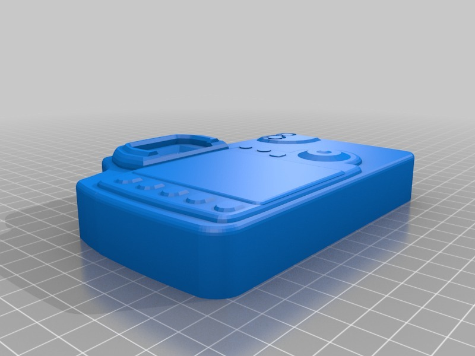
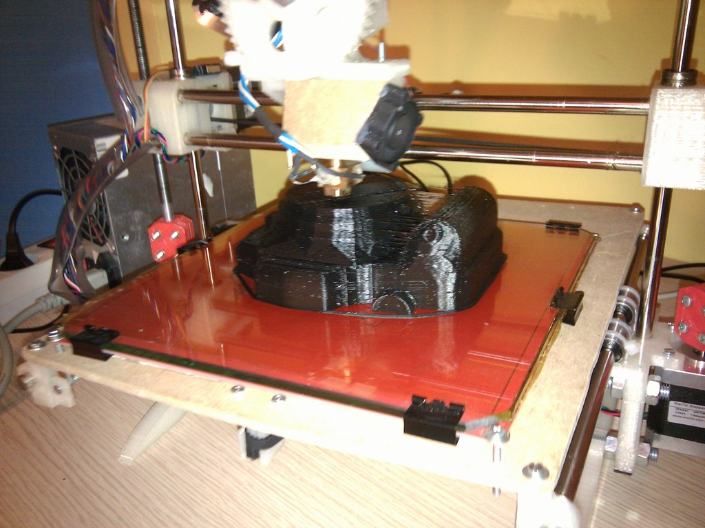

Tags
--------
350D , 3D , camera , Canon , EOS , model , plastic_valley , reprap , sketchup , UAM  

  

License
--------
Canon EOS 350D model by carlosgs is licensed under the Creative Commons - Attribution license.  

By: Carlos Garcia Saura (carlosgs)
--------
<http://carlosgs.es/>