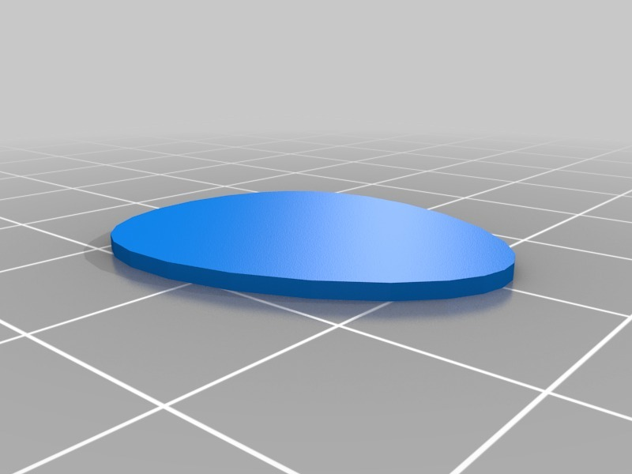

Creepick
===============
**Please note: This thing is part of a list that was [automatically generated](https://github.com/carlosgs/export-things) and may have been updated since then. Make sure to check for the current license and authorship.**  

Creepick  by carlosgs , published Jun 28, 2012

Description
--------
Just a creeper-themed guitar pick :)

Instructions
--------
1) Print 
2) Learn to play the guitar 
3) Play the guitar 
 
The original pick: <a href="http://www.thingiverse.com/thing:1709" target="_blank" rel="nofollow">thingiverse.com/thing:1709</a> 
Original creeper idea: @albertnez 
Creepick name: @bertoDLKai13 

Files
--------

 [ Creepick.scad](Creepick.scad)  

 [ guitar-pick-1709.stl](guitar-pick-1709.stl)  

 [ creeper_face.dxf](creeper_face.dxf)  

 [ Creepick.stl](Creepick.stl)  

Pictures
--------

Tags
--------
creeper , guitar , Guitar_Pick , music , openscad , pick  

  

License
--------
Creepick by carlosgs is licensed under the Attribution - Non-Commercial - Share Alike license.  

By: Carlos Garcia Saura (carlosgs)
--------
<http://carlosgs.es/>