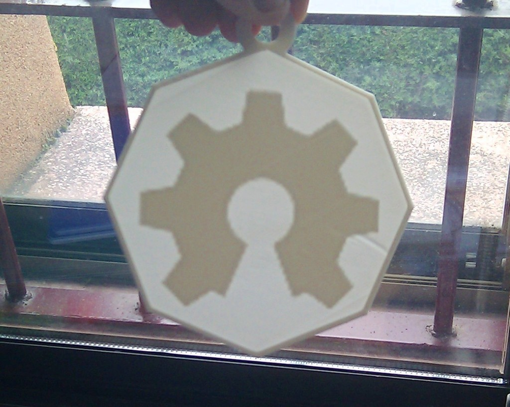
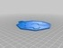
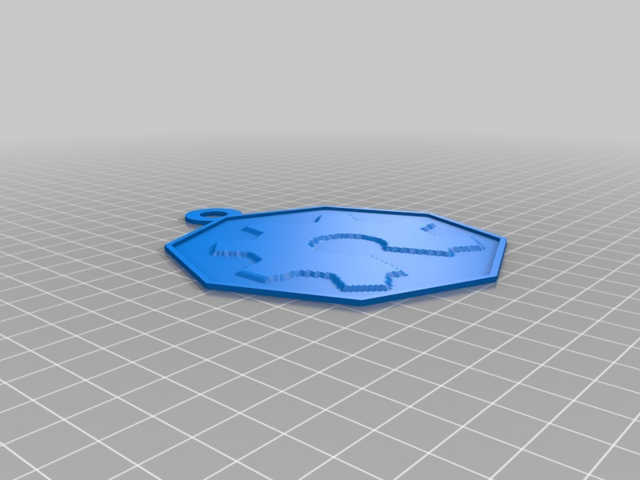

Customizable Lithophane
===============
**Please note: This thing is part of a list that was [automatically generated](https://github.com/carlosgs/export-things) and may have been updated since then. Some already have [their own GitHub page!](https://github.com/carlosgs?tab=repositories). Make sure to check for the current license and authorship.**  

[With polygonal frame] Customizable Lithophane  by carlosgs , published May 2, 2013

Description
--------
After printing a few square lithophanes I realized the corners usually got off the printbed.   
In order to fix that, here is the non-square (polygonal) version of the lithophane generator.   
 
Special mention to this other customizable lithophane by **MichaelAtOz:** <a href="http://www.thingiverse.com/thing:78719" target="_blank" rel="nofollow">thingiverse.com/thing:78719</a>  
 
Original description from Makerbot:   
--   
Click "Open in Customizer" to turn the image of your choice into a Lithopane! We used the Mona Lisa, but you could use any photo you want. The Lithopane tool generates a 3D model that looks like a rough terrain map.   
 
Download the file, print it on your MakerBot Desktop 3D Printer, and you've got a picture perfect pane to hang on your window.   
 
Three cheers for the lithopane pioneers on Thingiverse, such as cymon and pp3dpNL! For more information on this old art form, check out the Wikipedia article here: <a href="http://en.wikipedia.org/wiki/Lithophane" target="_blank" rel="nofollow">en.wikipedia.org/wiki/Lithophane</a>

Instructions
--------
Original instructions from Makerbot:   
--   
Upload an image, check the invert colors checkbox and create a Lithopane. For best results, upload a square image and print using a light colored plastic at 0.2 mm layer height and 1 shell.   
 
Once printed, hang your picture in a window.

Files
--------

 [ uploads-12-c4-26-17-3d-lithophaneV2.scad](uploads-12-c4-26-17-3d-lithophaneV2.scad)  

 [ oshw_lithophane.stl](oshw_lithophane.stl)  

Pictures
--------

Tags
--------
customizer , lithopane , lithophane , polygonal  

  

License
--------
[With polygonal frame] Customizable Lithophane by carlosgs is licensed under the Creative Commons - Attribution - Share Alike license.  

By: Carlos Garcia Saura (carlosgs)
--------
<http://carlosgs.es/>