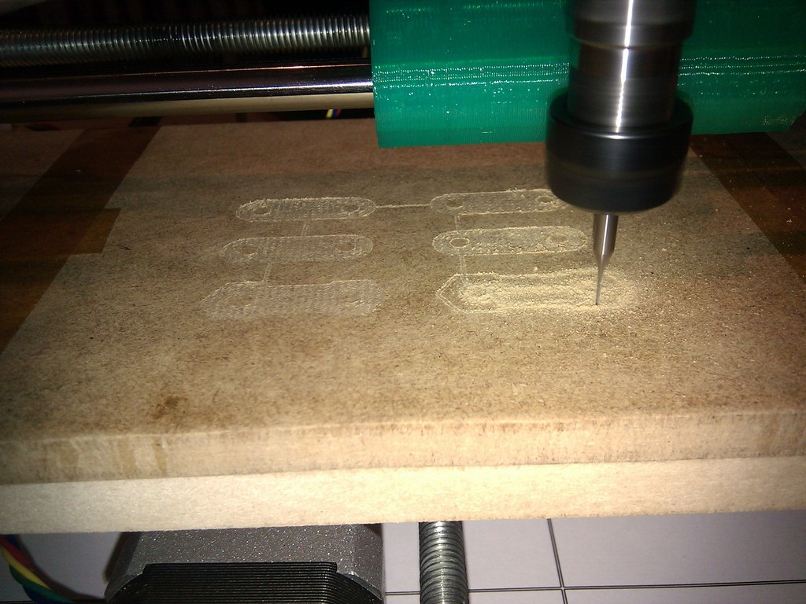
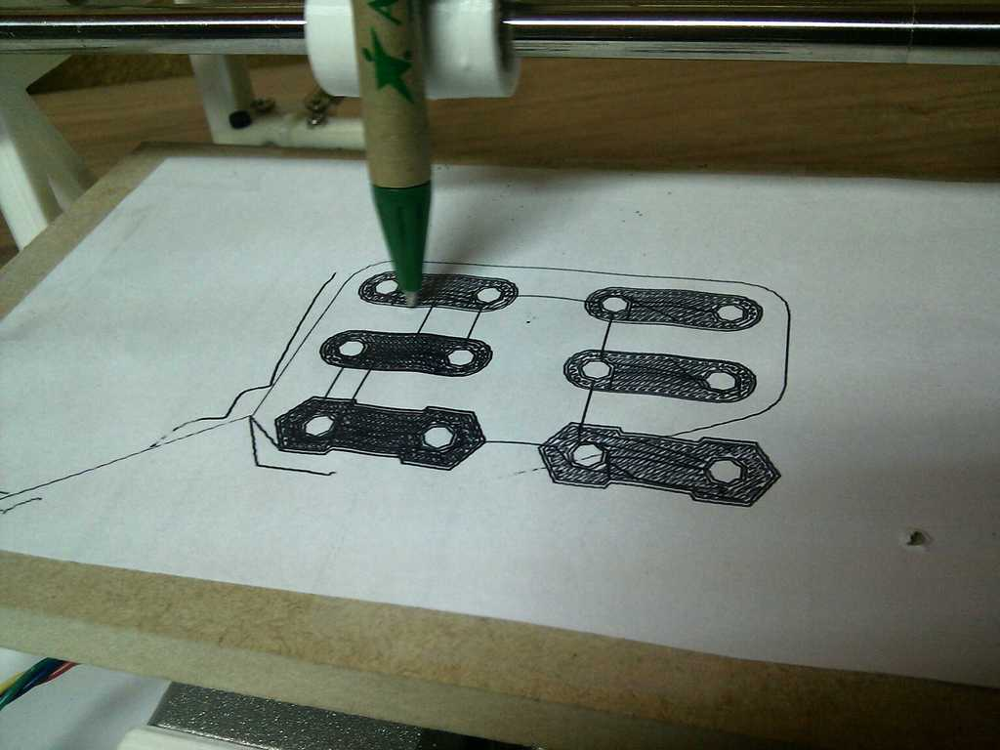

Cyclone PCB Factory v0.9.7
===============
**Please note: This thing is part of a list that was [automatically generated](https://github.com/carlosgs/export-things) and may have been updated since then. Make sure to check for the current license and authorship.**  

Cyclone PCB Factory v0.9.7 [added video summary]  by carlosgs , published Feb 11, 2013

Description
--------
 
Video summary: <a href="http://www.youtube.com/watch?v=fKW3fwy1h0k" target="_blank" rel="nofollow">youtube.com/watch?v=fKW3fwy1h0k</a>  
--   
 
More info in <a href="http://reprap.org/wiki/Cyclone_PCB_Factory" target="_blank" rel="nofollow">reprap.org/wiki/Cyclone_PCB_Factory</a>  
==   
 
Download (Git): **Now all the files are hosted in GitHub:** <a href="https://github.com/carlosgs/Cyclone-PCB-Factory" target="_blank" rel="nofollow">github.com/carlosgs/Cyclone-PCB-Factory</a>  
-   
Cyclone (Circuit Cloner) is a design for a CNC mill intended for PCB manufacturing.   
--   
It is a work in progress, looking forward to your suggestions and improvements.   
 
Special thanks:   
--   
- Z axis concepts by **Quim Borras** and the spindle motor holder by **Misan** were really useful!! Also, **Diego Viejo**'s machine was of great inspiration for the Z axis (https://plus.google.com/u/0/photos/113930344830086538817/albums/5868944432651911713?authkey=CLDJgdehlN773gE) **Thank you all!!**   
- This design woudn't have been possible without the encouragement of the **Panda CNC community** (https://plus.google.com/u/0/communities/102402711800402614517)   
- Also, thanks to **Obijuan** (http://iearobotics.com) for naming the machine Cyclone :)

Instructions
--------
Work in progress, please refer to the pictures.   
 
News:   
--   
* First Z probing results are promising, read: <a href="https://plus.google.com/u/0/113437723819360223498/posts/9VCHqqnirj6" target="_blank" rel="nofollow">plus.google.com/u/0/113437723819360223498/posts/9VCHqqnirj6</a>  and <a href="https://plus.google.com/u/0/113437723819360223498/posts/89W2cv1fgQW" target="_blank" rel="nofollow">plus.google.com/u/0/113437723819360223498/posts/89W2cv1fgQW</a>  
* Added the python probing script (v0.1) and Octave/Matlab visualizer   
 
Videos:   
--   
- v0.9.5 Probing a PCB <a href="http://www.youtube.com/watch?v=m5zXL8k5T9E" target="_blank" rel="nofollow">youtube.com/watch?v=m5zXL8k5T9E</a>  
- v0.9.5 Milling MDF <a href="http://www.youtube.com/watch?v=2QpxjheEjEc" target="_blank" rel="nofollow">youtube.com/watch?v=2QpxjheEjEc</a> and <a href="http://www.youtube.com/watch?v=zjav0hBtmYA" target="_blank" rel="nofollow">youtube.com/watch?v=zjav0hBtmYA</a>  
- v0.8 Drawing test: <a href="http://www.youtube.com/watch?v=Y-HSdE89JOM" target="_blank" rel="nofollow">youtube.com/watch?v=Y-HSdE89JOM</a>  
- v0.7.5 XY axis test: <a href="http://www.youtube.com/watch?v=9umlq4oHG64" target="_blank" rel="nofollow">youtube.com/watch?v=9umlq4oHG64</a>  
- v0.7.5 High speed XY test: <a href="http://www.youtube.com/watch?v=H3uYCXryj60" target="_blank" rel="nofollow">youtube.com/watch?v=H3uYCXryj60</a>  
 
Bill of materials:   
--   
<a href="https://docs.google.com/spreadsheet/ccc?key=0AsQp8IK25R4IdGk3LTdOWmpFR0Nrc0RhaVJaUC1CMUE" target="_blank" rel="nofollow">docs.google.com/spreadsheet/ccc?key=0AsQp8IK25R4IdGk3LTdOWmpFR0Nrc0RhaV JaUC1CMUE</a>  
 
Notes:   
--   
- Using a thick wood piece as the main base.   
- As shown in one of the pictures, a cheap dremel-like drill has nice bearings and is a good option as the main tool. **Finally it will be using a proper spindle** (check the BOM for the reference).   
- Desired working range of &gt;=100mm for the X axis and &gt;=160mm for the Y axis.   
- Parts are designed to be printable with the small volume of a Printrbot Jr   
- Bed leveling will be done with probing and an appropriate software.   
 
To-Do list:   
--   
- [99% DONE] Design parts for the X axis (this includes Z axis too, **will be using a proper spindle instead of a hand-drill**)   
- [DONE] Design parts for the Y axis   
- [DONE] Create template for the screws in the wood base   
- Software, testing, milling a PCB (till then, it can't be v1.0 :P)...   
 
Software   
--   
Here is a compilation of links that I find interesting for the software controller:   
 
- <a href="http://www.re-innovation.co.uk/web12/index.php/en/blog-75/181-making-pcbs-with-a-cnc-machine" target="_blank" rel="nofollow">re-innovation.co.uk/web12/index.php/en/blog-75/181-making-pcbs-with-a-cnc-machine</a>  
- <a href="http://phk.freebsd.dk/CncPcb/" target="_blank" rel="nofollow">phk.freebsd.dk/CncPcb/</a>  
- <a href="http://wiki.linuxcnc.org/cgi-bin/wiki.pl?Touch_Probe" target="_blank" rel="nofollow">wiki.linuxcnc.org/cgi-bin/wiki.pl?Touch_Probe</a>  
- <a href="http://things.onshoulders.org/software/PcbSubtraction.php" target="_blank" rel="nofollow">things.onshoulders.org/software/PcbSubtraction.php</a>  
- <a href="http://www.cnczone.com/forums/pcb_milling/82628-cheap_simple_height-probing-5.html" target="_blank" rel="nofollow">cnczone.com/forums/pcb_milling/82628-cheap_simple_height-probing-5.html</a>  
- <a href="http://drillcity.stores.yahoo.net/" target="_blank" rel="nofollow">drillcity.stores.yahoo.net/</a>  
- <a href="http://www.drewtronics.net/" target="_blank" rel="nofollow">drewtronics.net/</a>  
 
- **Examples of the PCB probing method**   
 - onshouldersTv: Open Source Circuit Boards at Home <a href="http://www.youtube.com/watch?v=L-5SRtwx3kY" target="_blank" rel="nofollow">youtube.com/watch?v=L-5SRtwx3kY</a>  
 - PCB routing using the Probe method <a href="http://www.youtube.com/watch?v=fwgT9sCL8fs" target="_blank" rel="nofollow">youtube.com/watch?v=fwgT9sCL8fs</a>  
- <a href="http://pcbgcode.org/" target="_blank" rel="nofollow">pcbgcode.org/</a>  
- <a href="http://sourceforge.net/apps/mediawiki/pcb2gcode/index.php?title=Main_Page" target="_blank" rel="nofollow">sourceforge.net/apps/mediawiki/pcb2gcode/index.php?title=Main_Page</a>  
- Very interesting toguether with cam.py: <a href="http://code.google.com/p/pygerber2gcode/" target="_blank" rel="nofollow">code.google.com/p/pygerber2gcode/</a>  
- <a href="http://replicat.org/generators" target="_blank" rel="nofollow">replicat.org/generators</a>  
- For arranging panels: <a href="http://ruggedcircuits.com/gerbmerge/" target="_blank" rel="nofollow">ruggedcircuits.com/gerbmerge/</a>  
 
License: CC-BY-SA   
--   
You are more than welcome to suggest/modify/redistribute :-)   
 
Credit for the ideas used   
--   
The origin of Cyclone took place while I was inside the __Panda CNC__ community (https://plus.google.com/u/0/communities/102402711800402614517). This is from December 2012 to mid-February 2013.   
Here is the credit for the ideas that were used:   
 
* __Lets design a 3D-printable CNC for PCB milling, it will be named Panda:__ Guillermo Welch (mid-December, via Google Talk)   
* __X carriage rod distribution:__ Csar Augusto Fernndez Cano claims Cyclone's X axis is a derivate of his concept: <a href="https://plus.google.com/u/0/111421387442355054591/posts/QrfYtEuZBaj" target="_blank" rel="nofollow">plus.google.com/u/0/111421387442355054591/posts/QrfYtEuZBaj</a>  
* __100x160mm workspace:__ David Martin <a href="https://dl.dropboxusercontent.com/u/16122275/PandaCNC_credit/workplace_size.png" target="_blank" rel="nofollow">dl.dropboxusercontent.com/u/16122275/PandaCNC_credit/workplace_size.png</a>  
* __Using gears to drive the X-Y axes:__ Guillermo Welch <a href="https://plus.google.com/u/0/101232926728463427403/posts/QjZGNcWcgGg" target="_blank" rel="nofollow">plus.google.com/u/0/101232926728463427403/posts/QjZGNcWcgGg</a>  
* __Regarding the woodbase:__ Guillermo Welch always contemplated the possibility of attaching the machine (optionally) to a woodbase. I decided to use the base as a main structural part instead. See <a href="https://dl.dropboxusercontent.com/u/16122275/PandaCNC_credit/woodbase.png" target="_blank" rel="nofollow">dl.dropboxusercontent.com/u/16122275/PandaCNC_credit/woodbase.png</a> (screenshot from <a href="https://plus.google.com/u/0/113437723819360223498/posts/8LDCSSVWqCS" target="_blank" rel="nofollow">plus.google.com/u/0/113437723819360223498/posts/8LDCSSVWqCS</a>)   
* __List of CNC endmill types:__ David Martin <a href="https://dl.dropboxusercontent.com/u/16122275/PandaCNC_credit/cnc_endmill_types.png" target="_blank" rel="nofollow">dl.dropboxusercontent.com/u/16122275/PandaCNC_credit/cnc_endmill_types.png</a>  
 
Please note I have taken screenshots of the post that are on the closed G+ Panda community (https://plus.google.com/u/0/communities/116318709564872967169). You can register and see by yourself.   
 
**All other development present on Cyclone has nothing to do with Panda and is not related to the Panda project.**

Files
--------

 [ Cyclone.stl](Cyclone.stl)  

Pictures
--------

Tags
--------
CNC , Cyclone , Mill , PCB , plastic_valley , printable , tool , UAM  

  

License
--------
Cyclone PCB Factory v0.9.7 [added video summary] by carlosgs is licensed under the Creative Commons - Attribution - Share Alike license.  

By: Carlos Garcia Saura (carlosgs)
--------
<http://carlosgs.es/>