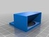
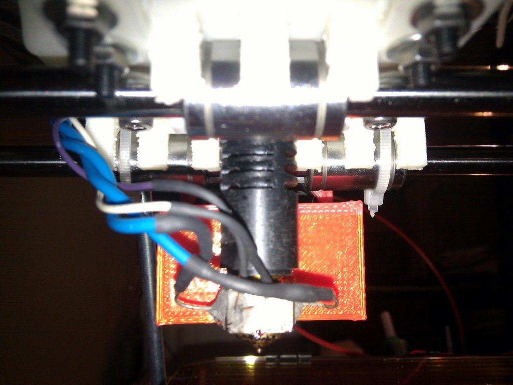

Hot-end fan mount with dual air flow
===============
**Please note: This list has been automatically generated. Some of the designs have been updated since then, and already have they own GitHub page.**  

Hot-end fan mount with dual air flow  by carlosgs , published Apr 6, 2012

Description
--------
With the new Slic3r "Cooling" option, using a fan in the hot-end to cool the layers faster is a great improvement in the print quality and speed. 
 
This part was designed to make it possible to cool down the hot-end heatsink and at the same time blow some air on the printed part, without dissipating heat from the hot-end itself. 
 
I was very inspired by thing <a href="http://www.thingiverse.com/thing:16266" target="_blank" rel="nofollow">thingiverse.com/thing:16266</a> but also wanted to have airflow over the printed part. 

Instructions
--------
This design was made using Sketchup, I will learn OpenScad soon and redesign it, I promise. 
 
Use the .stl provided for the J-Head hot-end. It could work for others, but I encourage you to adapt the dimensions to your hot-end. 
 
You can cover the plastic part that is closer to the nozzle with some kapton tape. 
 
I have printed lots of things with this dual airflow system and it is working really well so far. 

Files
--------

 [ soporte_ventilador.skp](soporte_ventilador.skp)  

 [ soporteventiladorlargo_fixed.stl](soporteventiladorlargo_fixed.stl)  

Pictures
--------

Tags
--------
3D , cooling , dual , fan , j-head , plastic_valley , sketchup , two-way , UAM  

Author: Carlos Garcia Saura (carlosgs)
--------
<http://carlosgs.es/>  

License
--------
Hot-end fan mount with dual air flow by carlosgs is licensed under the Creative Commons - Attribution - Share Alike license.  

