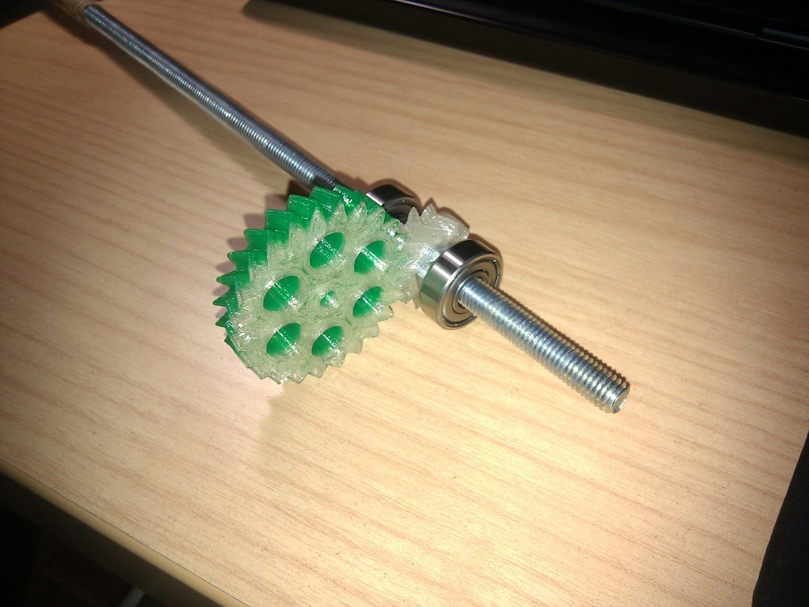
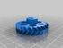
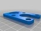
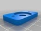
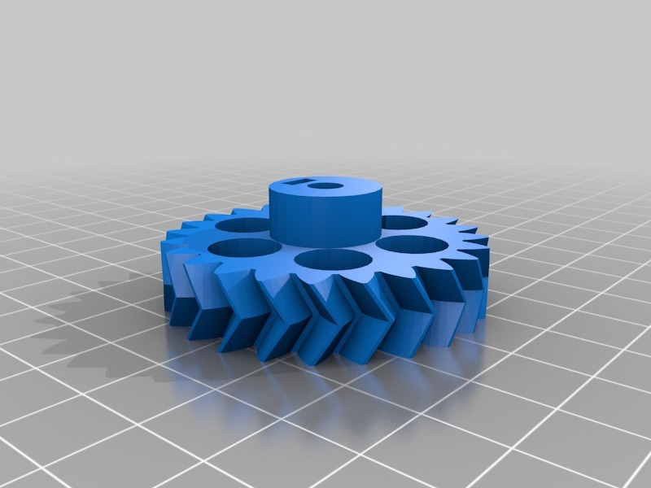
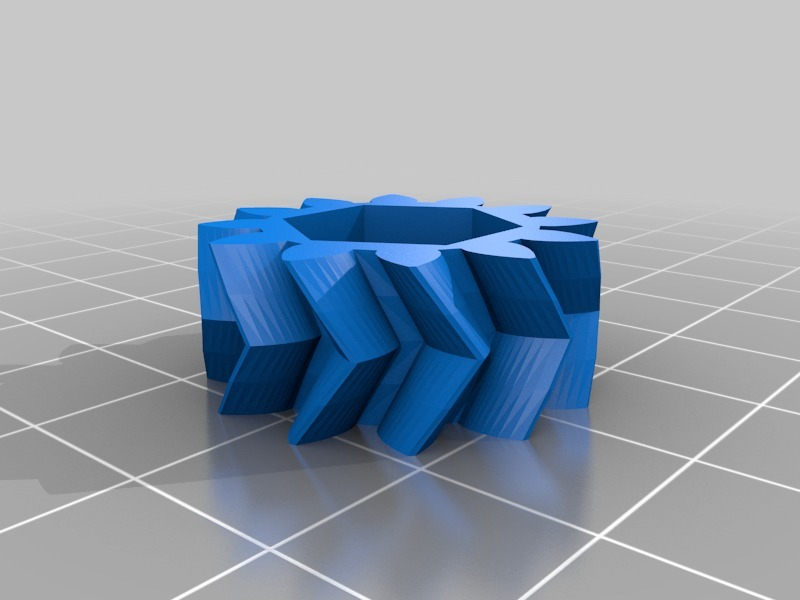
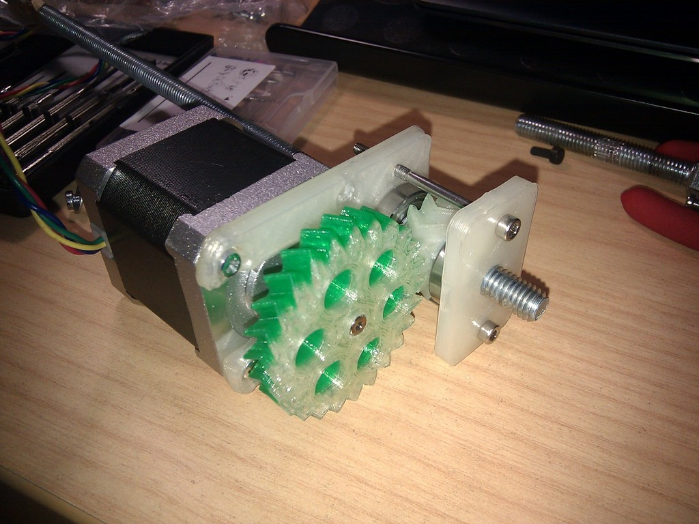
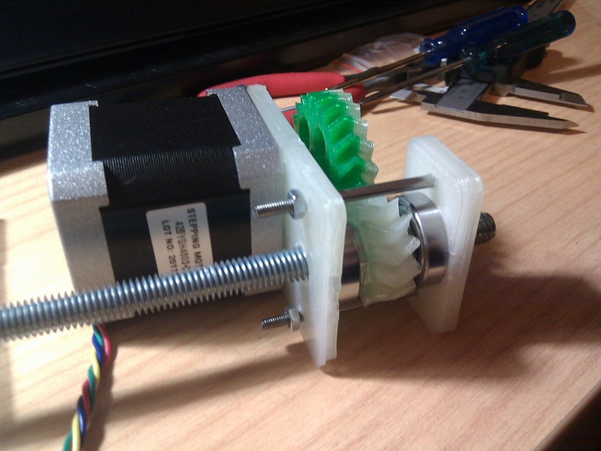
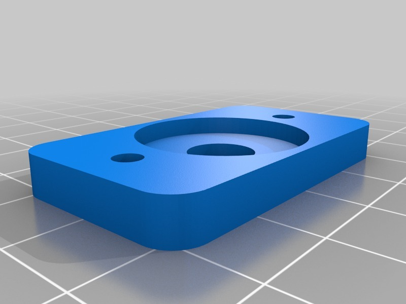
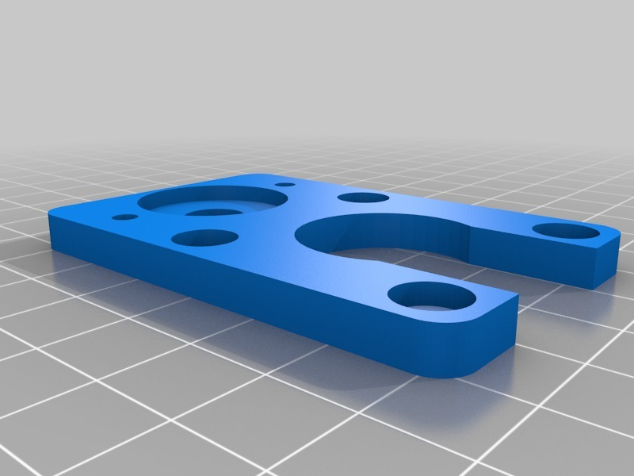

Linear actuator concept for CNC machines
===============
**Please note: This thing is part of a list that was [automatically generated](https://github.com/carlosgs/export-things) and may have been updated since then. Some already have [their own GitHub page!](https://github.com/carlosgs?tab=repositories) Make sure to check for the current license and authorship.**  

Linear actuator concept for CNC machines  by carlosgs , published Jan 28, 2013

Description
--------
We are looking for new ways to create a compact solution for moving the axis of a CNC machine. This is one of the concepts. 
 
The main idea is that the threaded rod is still (it does not rotate). Instead, the nut is the one that rotates. 
 
Please check out the video: <a href="http://www.youtube.com/watch?v=gZ7W4M-OSXI" target="_blank" rel="nofollow">youtube.com/watch?v=gZ7W4M-OSXI</a>

Instructions
--------
This object would require some redesign to fit your application. I have uploaded all the OpenScad sources.

Files
--------

 [ Y_motor_gear.stl](Y_motor_gear.stl)  

 [ Y_motor_stand.scad](Y_motor_stand.scad)  

 [ obiscad.zip](obiscad.zip)  

 [ Y_motor_stand.stl](Y_motor_stand.stl)  

 [ Y_motor_gear.scad](Y_motor_gear.scad)  

 [ Y_rod_floating_gear.scad](Y_rod_floating_gear.scad)  

 [ Y_bearing_idler.stl](Y_bearing_idler.stl)  

 [ Y_rod_floating_gear.stl](Y_rod_floating_gear.stl)  

Pictures
--------

Tags
--------
actuator , cnc , linear , Nema17 , plastic_valley , stepper , threaded_rod , UAM  

  

License
--------
Linear actuator concept for CNC machines by carlosgs is licensed under the Creative Commons - Attribution - Share Alike license.  

By: Carlos Garcia Saura (carlosgs)
--------
<http://carlosgs.es/>