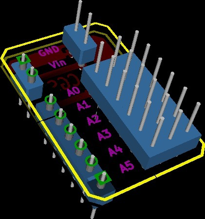

Minimalist Shield for Arduino Printbots
===============
**Please note: This thing is part of a list that was [automatically generated](https://github.com/carlosgs/export-things) and may have been updated since then. Some already have [their own GitHub page!](https://github.com/carlosgs?tab=repositories). Make sure to check for the current license and authorship.**  

Minimalist Shield for Arduino Printbots  by carlosgs , published Apr 30, 2012

Description
--------
Simple shield board that allows to connect servo-motors and other devices (like sensors) to the analog pins of an Arduino board (UNO or MEGA). 
It also has a connector for the batteries. 
 
You can use it in printbots like the MiniSkybot or the ArduSnake! (http://www.thingiverse.com/tag:printbot).

Instructions
--------
----- Building tips ----- 
  This circuit can be made easily using pre-drilled PCB board. 
  You can push the header pins all the way trough to be able to solder them on the other side of the PCB, even with one-layer designs like this one. 
 
----- Notes ----- 
  I have made some tests with an ArduSnake, using a previous version of the same circuit. Here is a video: <a href="https://www.youtube.com/watch?v=oEkTYmGqIWo" target="_blank" rel="nofollow">youtube.com/watch?v=oEkTYmGqIWo</a> 
  Still need to make this PCB, but as far I can tell it will work. 
  Analog pins can be used as digital: 
------ A0 -&gt; pin 14  
------  
------ A6 -&gt; pin 19 
  It is my first design using Kicad, please excuse my mistakes. 
 
----- Progress ----- 
  16/05/12 Built OK, here is a video: <a href="http://youtu.be/zC5MKcnZ27Q" target="_blank" rel="nofollow">youtu.be/zC5MKcnZ27Q</a> 
  02/05/12 Made a paper version and uploaded pictures 
  30/04/12 Uploaded version 1.0 of the board

Files
--------

 [ MiniShield_v1.0.zip](MiniShield_v1.0.zip)  

Pictures
--------

Tags
--------
analog , arduino , motor , pcb , pin_header , plastic_valley , printbot , servo , shield , UAM  

  

License
--------
Minimalist Shield for Arduino Printbots by carlosgs is licensed under the Creative Commons - Attribution - Share Alike license.  

By: Carlos Garcia Saura (carlosgs)
--------
<http://carlosgs.es/>