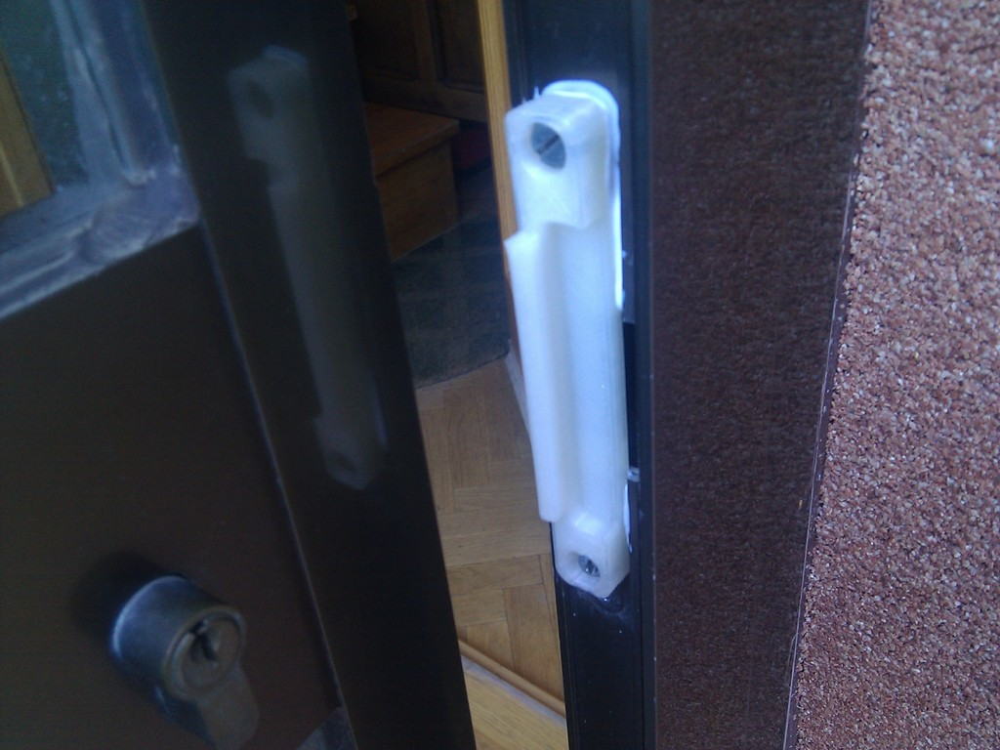
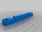
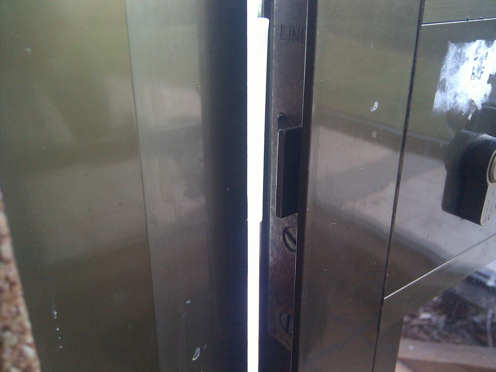
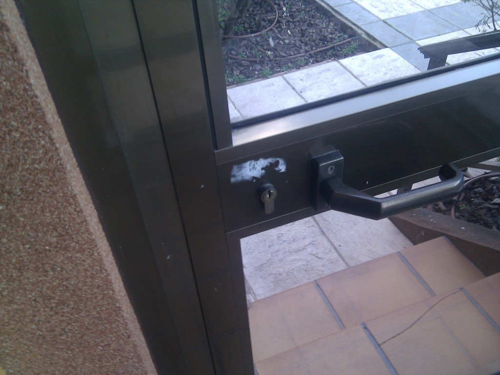
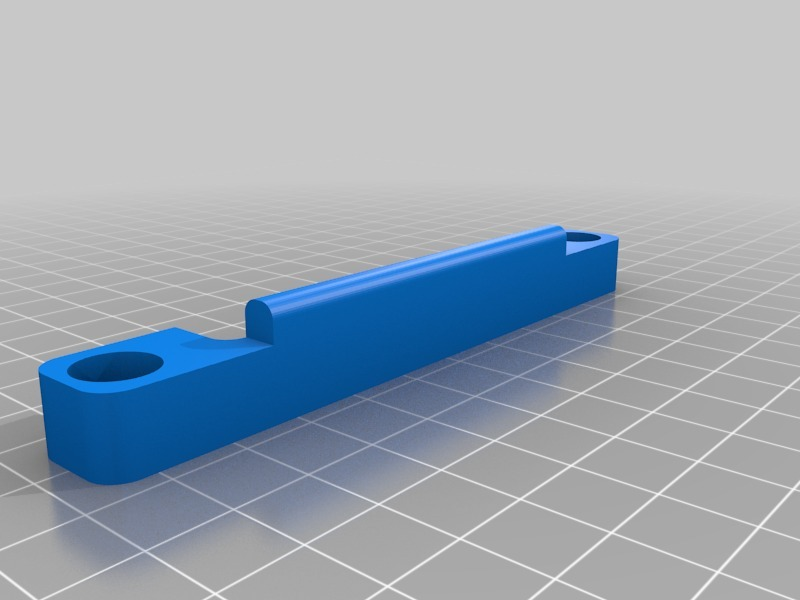

Parametric door fix
===============
**Please note: This thing is part of a list that was [automatically generated](https://github.com/carlosgs/export-things) and may have been updated since then. Some already have [their own GitHub page!](https://github.com/carlosgs?tab=repositories). Make sure to check for the current license and authorship.**  

Parametric door fix  by carlosgs , published Feb 2, 2013

Description
--------
Our glass door had stopped keeping itself closed, so I made this parametric part to fix it. 
Now the door closes properly, which helps saving energy by preventing heat-flows. 
 
Check the pictures for details.

Instructions
--------
Modify the .scad parameters, print and screw the piece in place. 
 
In the pictures you can see I put some white glue to make sure the piece doesn't move. Now this glue it is dry and has turned clear.

Files
--------

 [ door_fix.stl](door_fix.stl)  

 [ door_fix.zip](door_fix.zip)  

Pictures
--------

Tags
--------
door , fix , openscad , parametric , plastic_valley , UAM  

  

License
--------
Parametric door fix by carlosgs is licensed under the Creative Commons - Attribution - Share Alike license.  

By: Carlos Garcia Saura (carlosgs)
--------
<http://carlosgs.es/>