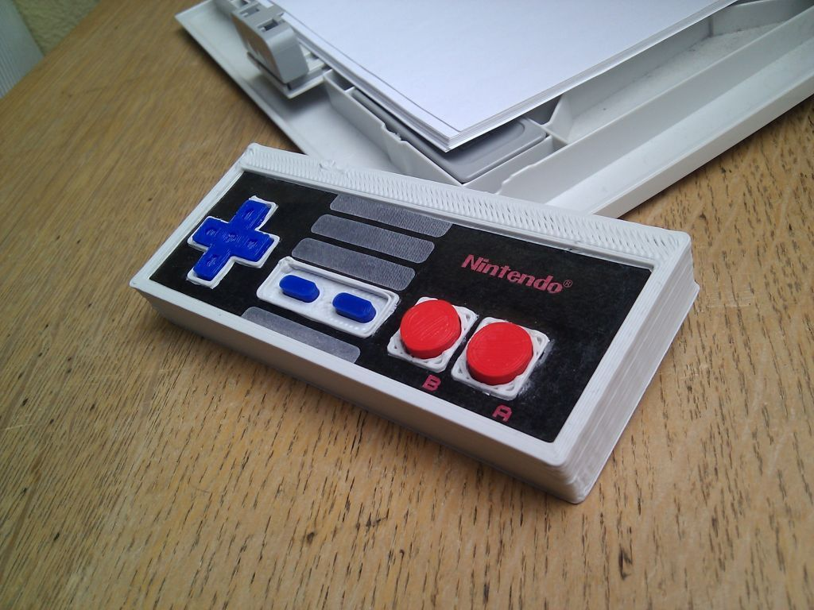
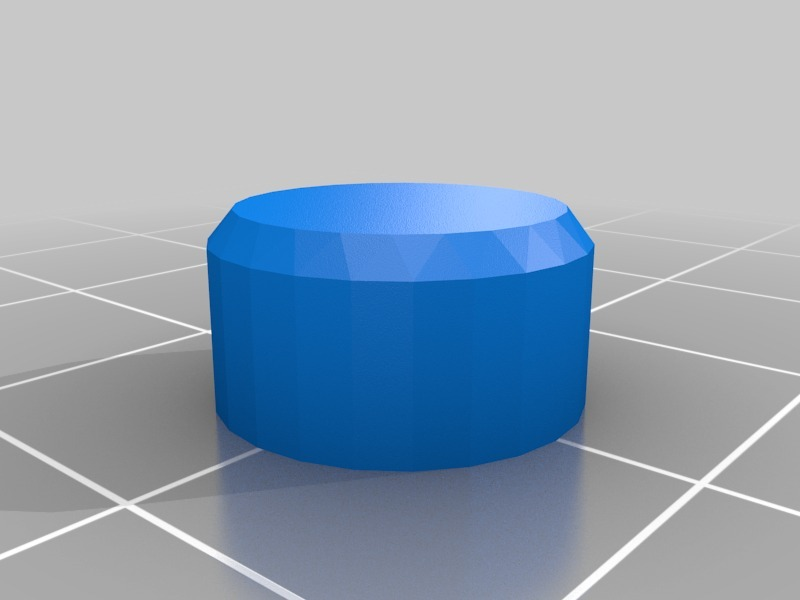

Printable NES controller
===============
**Please note: This thing is part of a list that was [automatically generated](https://github.com/carlosgs/export-things) and may have been updated since then. Some already have [their own GitHub page!](https://github.com/carlosgs?tab=repositories). Make sure to check for the current license and authorship.**  

Printable NES controller  by carlosgs , published May 5, 2012

Description
--------
Gotta love the NES. I had seen a few designs around here, but none of them color-printable. So after a few trial-redesign rounds, here is the final result :)

Instructions
--------
1) Print the body in white, A+B in red, and cross+start+select in blue/black. 
2) Assemble all the buttons, you can use soft foam to make them "press-able". 
3) 2D print the sticker (if you happen to have one of those rare 2D printer), plastify it, cut the holes with an X-Acto knife, and glue it in place. 
4) You can also put a cable with a connector to make it even more realistic. 
 
Design made in Sketchup. Again, I'm sorry for that. Summer is near and I will learn OpenSCAD soon.

Files
--------

 [ buttons_3D.skp](buttons_3D.skp)  

 [ start.stl](start.stl)  

 [ controller_3D.skp](controller_3D.skp)  

 [ cross_upside_down.stl](cross_upside_down.stl)  

 [ NES_controller_22549.zip](NES_controller_22549.zip)  

 [ controller3D_fixed.stl](controller3D_fixed.stl)  

 [ A.stl](A.stl)  

Pictures
--------

Tags
--------
3D , buttons , controller , Faberdashery , gamepad , NES , Nintendo , PLA , sketchup  

  

License
--------
Printable NES controller by carlosgs is licensed under the Creative Commons - Attribution - Share Alike license.  

By: Carlos Garcia Saura (carlosgs)
--------
<http://carlosgs.es/>