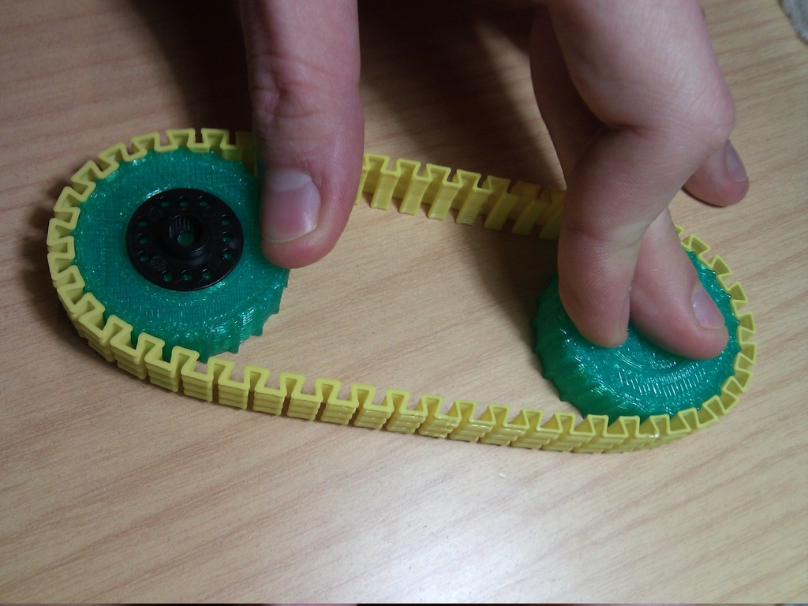
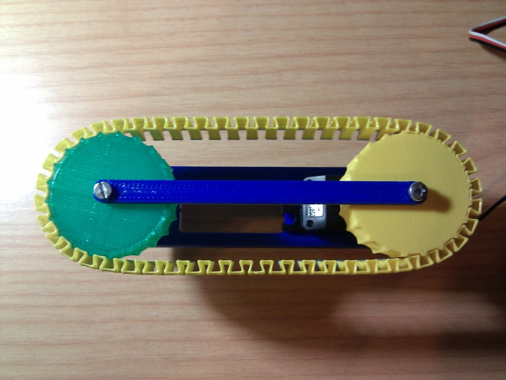
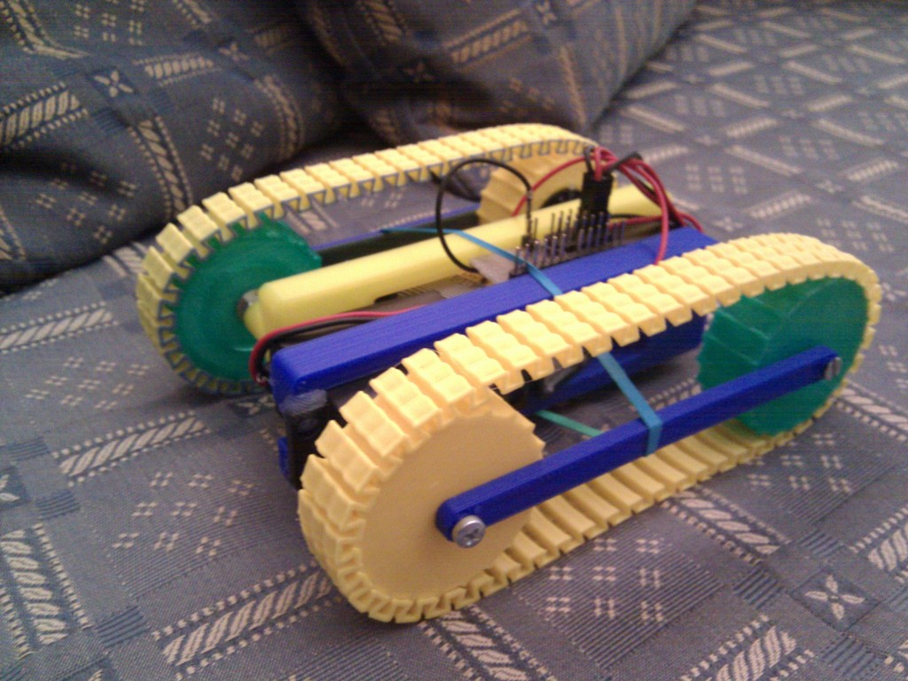

Printable caterpillar track
===============
**Please note: This list has been automatically generated. Some of the designs have been updated since then, and already have they own GitHub page.**  
Printable caterpillar track  by carlosgs , published Dec 8, 2012

Description
--------
Testing a caterpillar track that is printable in one piece :) 
 
UPDATE: Here is a video! <a href="http://www.youtube.com/watch?v=nigrV9n9658" target="_blank" rel="nofollow">youtube.com/watch?v=nigrV9n9658</a> 
 
UPDATE 2: New version 1.2 of the tracks and wheels: more curve to avoid slipping

Instructions
--------
Scad code is messy, but i wanted to publish the promising results ASAP :) 
 
Notes: 
- [DONE] An idler is required to reduce lateral force in the servo axis 
- [DONE] The chain needs to be even more curve to prevent it from slipping out 
- Still need to figure out a nice chassis 
 
 
In order to print the tracks, I use Cura (https://github.com/daid/Cura) and a 0.5mm nozzle. 
Settings in Cura: 
Bottom/Top thickness = 0mm 
Wall thickness = 0.5mm 
Fill density = 0% 
Solid infill top = OFF 
Joris the outer edge = ON 
 
These settings will print the track as a continuous, single-walled spiral, which makes them very flexible and resistant :)

Files
--------

 [ Caterpillar_track_1.1.zip](Caterpillar_track_1.1.zip)  

 [ chassis.stl](chassis.stl)  

 [ wheel_1.1.stl](wheel_1.1.stl)  

 [ Caterpillar_track_1.1.stl](Caterpillar_track_1.1.stl)  

 [ Caterpillar_track_1.2.zip](Caterpillar_track_1.2.zip)  

Pictures
--------

Tags
--------
Caterpillar , plastic_valley , printbot , robot , UAM  

Author: Carlos Garcia Saura (carlosgs)
--------
<http://carlosgs.es/>  

License
--------
Printable caterpillar track by carlosgs is licensed under the Creative Commons - Attribution - Share Alike license.  

