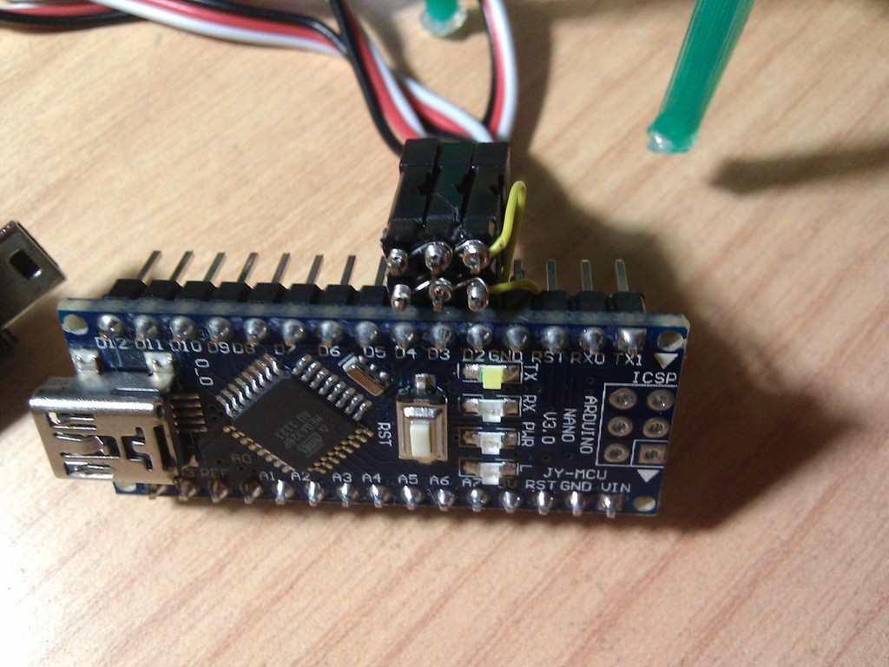

Printed Micro-Hexapod (Plate and code)
===============
**Please note: This thing is part of a list that was [automatically generated](https://github.com/carlosgs/export-things) and may have been updated since then. Some already have [their own GitHub page!](https://github.com/carlosgs?tab=repositories). Make sure to check for the current license and authorship.**  

Printed Micro-Hexapod (Plate and code)  by carlosgs , published Nov 17, 2012

Description
--------
I wanted to share my improvements on the great printable hexapod by Ijon: 
- an STL plate for printing in small machines like the Printrbot Jr 
- Sample Arduino source code based on the ArduSnake oscillators library by Obijuan

Instructions
--------
Print, put everything together (with screws and hot-glue), connect, program and enjoy :) 
 
For the Arduino code, you will need to install the ArduSnake oscillators library <a href="https://github.com/Obijuan/ArduSnake" target="_blank" rel="nofollow">github.com/Obijuan/ArduSnake</a> 
It is a very simple code thanks to the power of this library :) 
 
Here is a demo video showing some patterns: <a href="http://www.youtube.com/watch?v=FPwyOtpsSBA" target="_blank" rel="nofollow">youtube.com/watch?v=FPwyOtpsSBA</a> 
 
All credit of the design goes to Ijon (http://www.thingiverse.com/Ijon), thank you! :)

Files
--------

 [ hexapodFullDemo.ino](hexapodFullDemo.ino)  

 [ hexapod.ino](hexapod.ino)  

 [ body.stl](body.stl)  

 [ legs.stl](legs.stl)  

Pictures
--------

Tags
--------
arduino , oscillators , plastic_valley , printbot , robot , UAM  

  

License
--------
Printed Micro-Hexapod (Plate and code) by carlosgs is licensed under the Creative Commons - Attribution - Share Alike license.  

By: Carlos Garcia Saura (carlosgs)
--------
<http://carlosgs.es/>