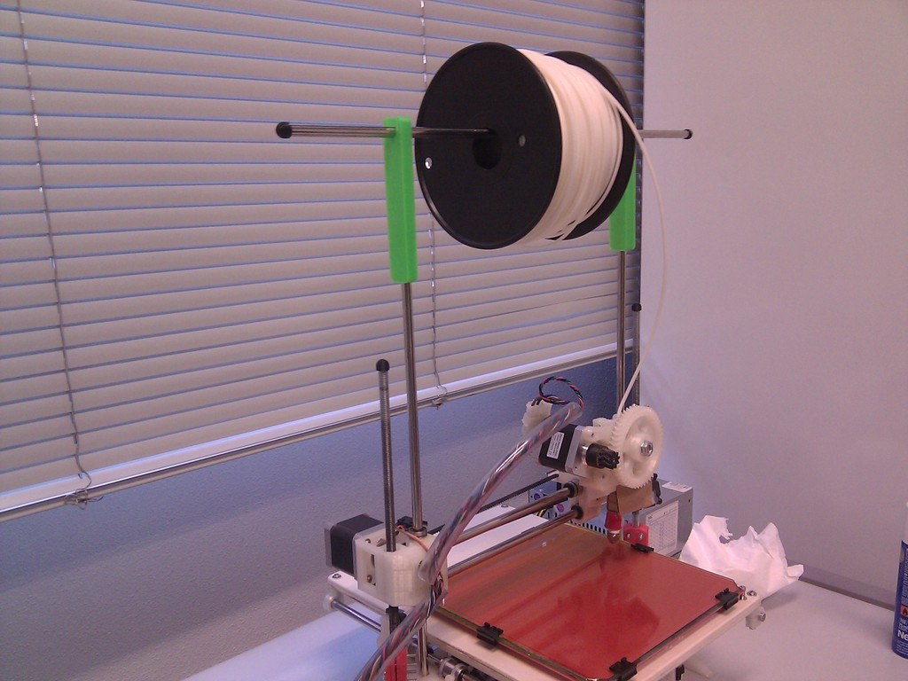

Printrbot Spool Holder
===============
**Please note: This thing is part of a list that was [automatically generated](https://github.com/carlosgs/export-things) and may have been updated since then. Some already have [their own GitHub page!](https://github.com/carlosgs?tab=repositories) Make sure to check for the current license and authorship.**  

Printrbot Spool Holder  by carlosgs , published Mar 25, 2013

Description
--------
A simple spool holder (_M8 rods_)

Instructions
--------
Print two pieces and use a smooth rod to hold the spool of filament. 
You may need to use the Printrbot rods end hat (http://www.thingiverse.com/thing:21134) to avoid the smooth rod sliding out.

Files
--------

 [ spool_holder.stl](spool_holder.stl)  

 [ Printrbot_Spool_Holder_scad.zip](Printrbot_Spool_Holder_scad.zip)  

Pictures
--------

Tags
--------
filament , holder , Printrbot , spool , spool_holder  

  

License
--------
Printrbot Spool Holder by carlosgs is licensed under the Creative Commons - Attribution - Share Alike license.  

By: Carlos Garcia Saura (carlosgs)
--------
<http://carlosgs.es/>