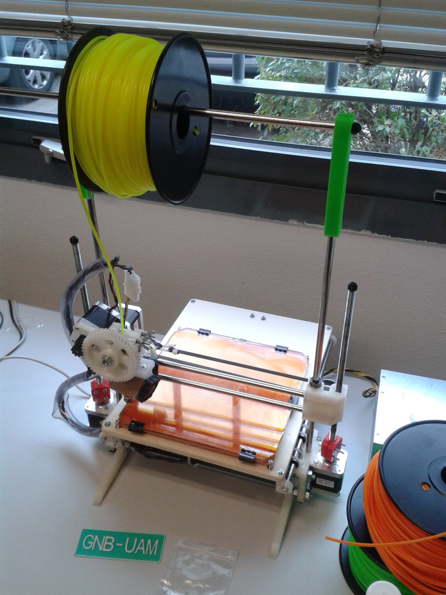
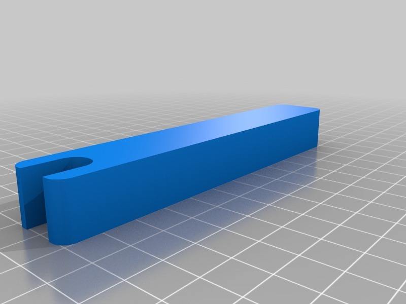

Printrbot Spool Holder
===============

Description
--------
A simple spool holder (_M8 rods_)

Instructions
--------
Print two pieces and use a smooth rod to hold the spool of filament. 
You may need to use the Printrbot rods end hat (http://www.thingiverse.com/thing:21134) to avoid the smooth rod sliding out.

Files
--------

 [ spool_holder.stl](spool_holder.stl "Title")  

 [ Printrbot_Spool_Holder_scad.zip](Printrbot_Spool_Holder_scad.zip "Title")  

Pictures
--------

Author: carlosgs
--------

License
--------
CC-BY-SA (unless other specified)

