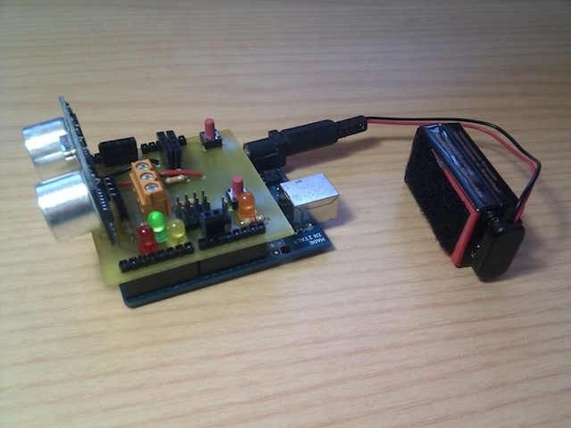
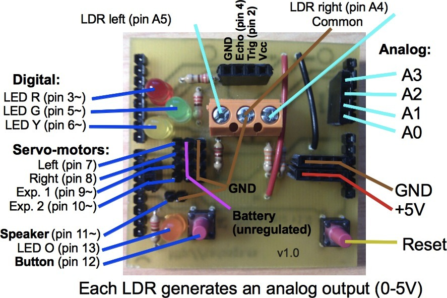
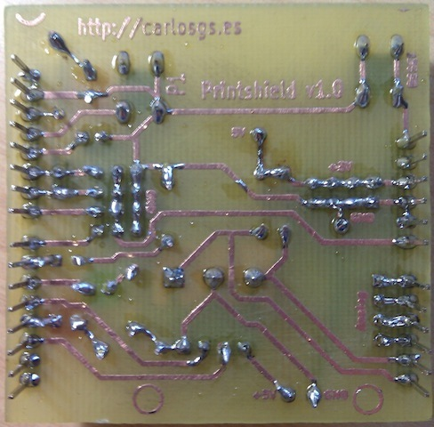
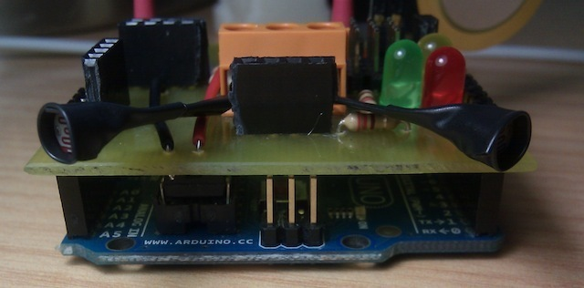
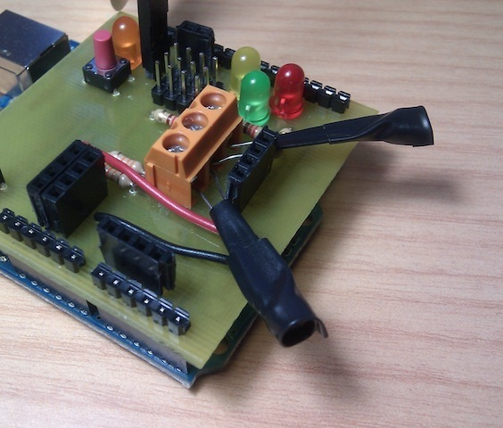
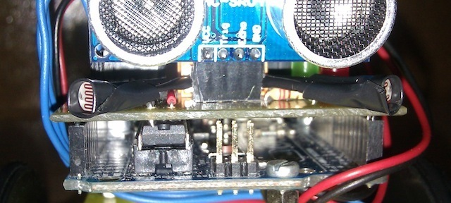
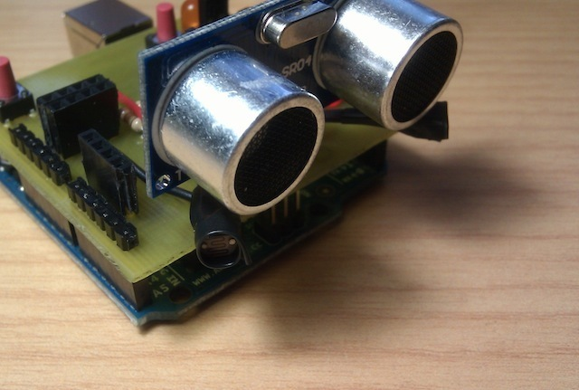

Printshield v1.0 for Arduino printbots
===============
Printshield v1.0 for Arduino printbots [Git repo]  by carlosgs , published Jul 18, 2012

Description
--------
Download (Git): **Now all the files are hosted in GitHub:** <a href="https://github.com/carlosgs/ArduSkybot/tree/master/Electronics" target="_blank" rel="nofollow">github.com/carlosgs/ArduSkybot/tree/master/Electronics</a>  
==   
 
Circuit board that simplifies making Printbots based on Arduino UNO! :)   
 
It is one-sided so anyone can make it easily.   
 
Features:   
-Two light sensors (LDR)   
-One ultrasonic distance sensor   
-Two buttons   
-Four LEDs   
-Four servo-motor connectors   
-Compatible with CNY70 board (http://www.thingiverse.com/thing:26819)   
 
Component values:   
The cap is 1000uF 6.3V (between +5V and ground), LED resistors 330ohm, LDR resistors 33kohm

Instructions
--------
You can use one of this methods to make the PCB: 
<a href="http://youtube.com/watch?v=QQupRXEqOz4" target="_blank" rel="nofollow">youtube.com/watch?v=QQupRXEqOz4</a> 
<a href="http://instructables.com/id/Toner-transfer-no-soak-high-quality-double-sided/" target="_blank" rel="nofollow">instructables.com/id/Toner-transfer-no-soak-high-quality-double-sided/</a> (this one didn't work for me, you should try it anyway...) 
 
I have uploaded also the connection diagram so you can see the components :) 
 
Modifications (will be added in v2.0) 
- You should power the Arduino with at least 9V and place a capacitor in the 5V line when using servomotors (otherwise the board will reset due to voltage peaks). 
- It is a good idea to add one diode in series with the power line for the servos, this will help minimize voltage peaks that affect the 5V line. 
 
Uses: 
- Arduino shield library: <a href="http://www.thingiverse.com/thing:9630" target="_blank" rel="nofollow">thingiverse.com/thing:9630</a> 
- Monolito library: <a href="http://www.iearobotics.com/wiki/index.php?title=Monolito" target="_blank" rel="nofollow">iearobotics.com/wiki/index.php?title=Monolito</a> 
 
Designed with Kicad 

Files
--------

 [ printshield-1.0-Back_array.pdf](printshield-1.0-Back_array.pdf)  

Pictures
--------

Tags
--------
arduino , button , LDR , light , line , pcb , plastic_valley , printbot , robot , sensor , shield , UAM , ultrasonic  

Author: Carlos Garcia Saura (carlosgs)
--------

License
--------
Printshield v1.0 for Arduino printbots [Git repo] by carlosgs is licensed under the Creative Commons - Attribution - Share Alike license.  

