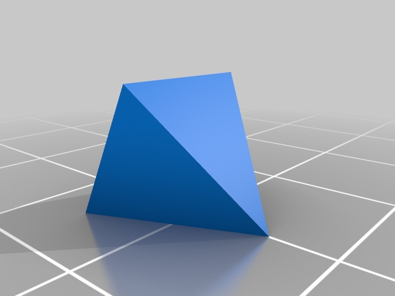
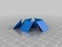
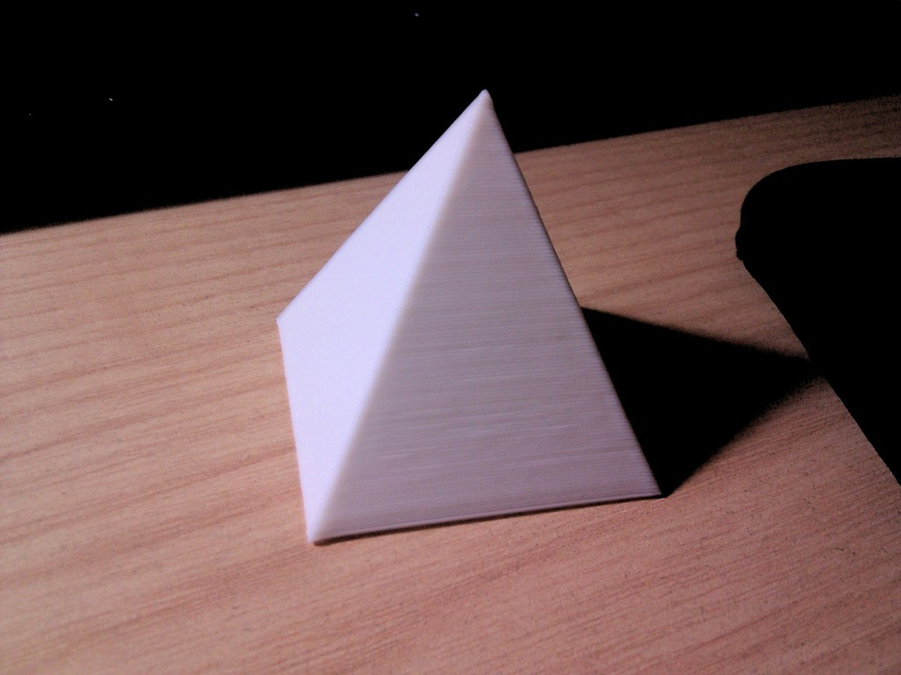
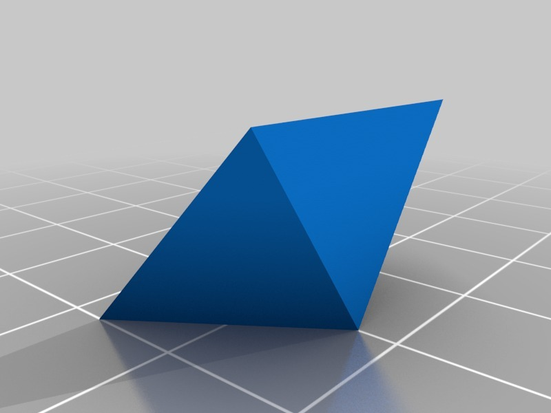
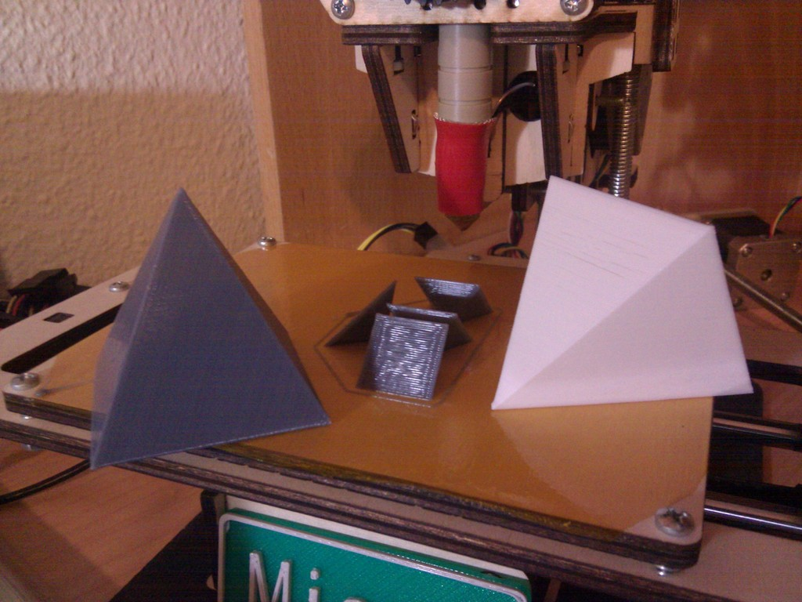
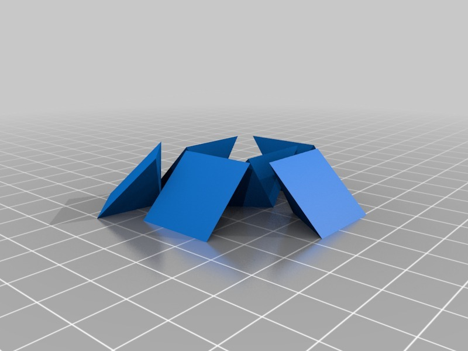
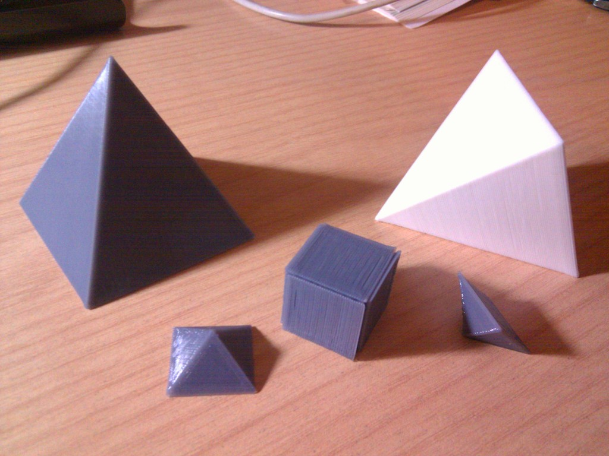

Pyramids (easy to print)
===============
**Please note: This list has been automatically generated. Some of the designs have been updated since then, and already have they own GitHub page.**  
[Parametric] Pyramids (easy to print)  by carlosgs , published Feb 12, 2013

Description
--------
Trying to print a pyramid vertically without getting the top vertex being a plastic mess is a challenge. 
 
I have not found a pyramid resting on a side for a more easy printing, so here it is! 
No more messy tops!! 
 
The source is from "Small Calibration Pyramid" by LawrenceJohnston (http://www.thingiverse.com/thing:22340) 
 
I have also added the equilateral version of the pyramid.

Instructions
--------
Customize, print and enjoy the useful pyramids :-)

Files
--------

 [ Pyramid_equilateral.stl](Pyramid_equilateral.stl)  

 [ Pyramid_equilateral_x6.stl](Pyramid_equilateral_x6.stl)  

 [ Pyramid_scad.zip](Pyramid_scad.zip)  

 [ Pyramid_isosceles.stl](Pyramid_isosceles.stl)  

 [ Parametric_pyramid.scad](Parametric_pyramid.scad)  

Pictures
--------

Tags
--------
3D , customizer , customizer_challenge , parametric , PLA , plastic_valley , pyramid , UAM  

Author: Carlos Garcia Saura (carlosgs)
--------
<http://carlosgs.es/>  

License
--------
[Parametric] Pyramids (easy to print) by carlosgs is licensed under the Creative Commons - Attribution - Share Alike license.  

