Things from carlosgs
===============

Printable NES controller
--------
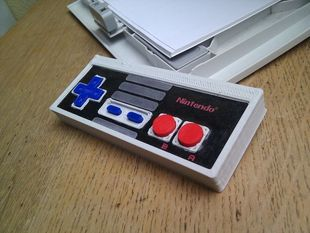

  [Printable NES controller](Printable-NES-controller "Title")  
Unicorn keychain
--------
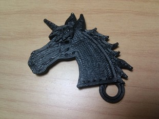

  [Unicorn keychain](Unicorn-keychain "Title")  
Pyramids (easy to print)
--------
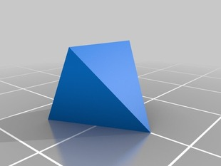

  [Pyramids (easy to print)](Pyramids-easy-to-print "Title")  
Linear actuator concept for CNC machines
--------
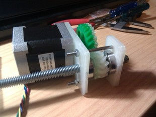

  [Linear actuator concept for CNC machines](Linear-actuator-concept-for-CNC-machines "Title")  
Smaller Printrbot rods end hat
--------
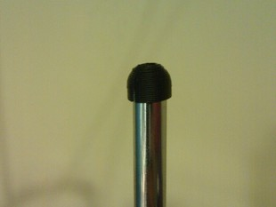

  [Smaller Printrbot rods end hat](Smaller-Printrbot-rods-end-hat "Title")  
Canon EOS 350D model
--------
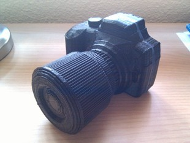

  [Canon EOS 350D model](Canon-EOS-350D-model "Title")  
Printrbot Spool Holder
--------
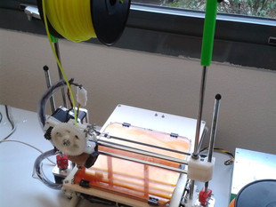

  [Printrbot Spool Holder](Printrbot-Spool-Holder "Title")  
RIP THINGIVERSE (+MAKERBOT + STRATASYS)
--------

  [RIP THINGIVERSE (+MAKERBOT + STRATASYS)](RIP-THINGIVERSE-+MAKERBOT-+-STRATASYS "Title")  
ArduSkyBot v1.0, an open source educational printbot
--------
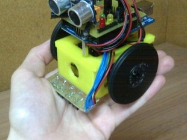

  [ArduSkyBot v1.0, an open source educational printbot](ArduSkyBot-v1.0,-an-open-source-educational-printbot "Title")  
Printed Micro-Hexapod (Plate and code)
--------
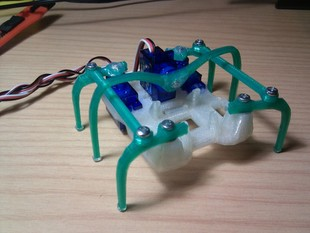

  [Printed Micro-Hexapod (Plate and code)](Printed-Micro-Hexapod-Plate-and-code "Title")  
Trisquel
--------
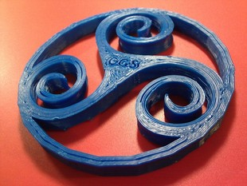

  [Trisquel](Trisquel "Title")  
SceneBeta logo
--------
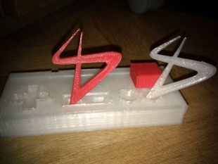

  [SceneBeta logo](SceneBeta-logo "Title")  
Minimalist Shield for Arduino Printbots
--------
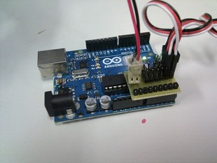

  [Minimalist Shield for Arduino Printbots](Minimalist-Shield-for-Arduino-Printbots "Title")  
Customizable Lithophane
--------
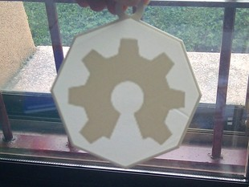

  [Customizable Lithophane](Customizable-Lithophane "Title")  
Better-hinged Google Android
--------
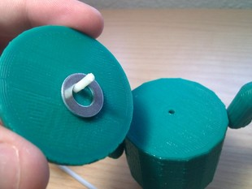

  [Better-hinged Google Android](Better-hinged-Google-Android "Title")  
Hot-end fan mount with dual air flow
--------

  [Hot-end fan mount with dual air flow](Hot-end-fan-mount-with-dual-air-flow "Title")  
ArduSkyBot v2.0
--------
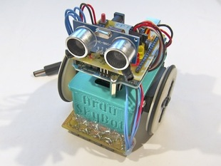

  [ArduSkyBot v2.0](ArduSkyBot-v2.0 "Title")  
Single piece peg-top! easy to print and customizable!
--------
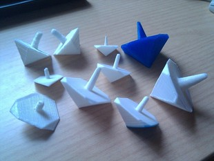

  [Single piece peg-top! easy to print and customizable!](Single-piece-peg-top!-easy-to-print-and-customizable! "Title")  
Printable caterpillar track
--------
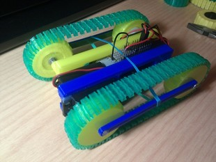

  [Printable caterpillar track](Printable-caterpillar-track "Title")  
Vector-9000, a fast line follower robot
--------
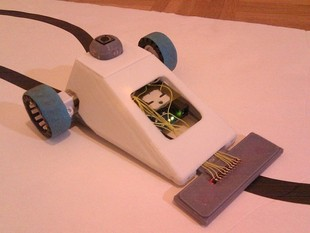

  [Vector-9000, a fast line follower robot](Vector-9000,-a-fast-line-follower-robot "Title")  
Cyclone PCB Factory v0.9.7
--------
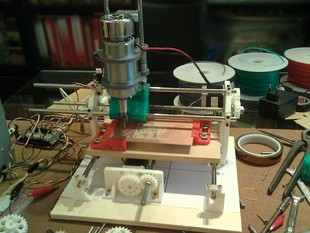

  [Cyclone PCB Factory v0.9.7](Cyclone-PCB-Factory-v0.9.7 "Title")  
Arduino based printbot HKTR-9000
--------
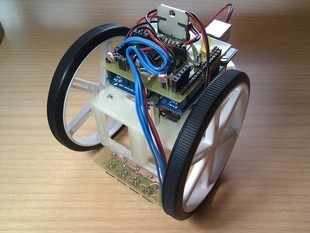

  [Arduino based printbot HKTR-9000](Arduino-based-printbot-HKTR-9000 "Title")  
Printshield v1.0 for Arduino printbots
--------
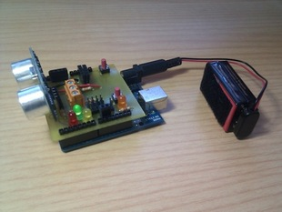

  [Printshield v1.0 for Arduino printbots](Printshield-v1.0-for-Arduino-printbots "Title")  
CNY70 sensor array for printbots
--------
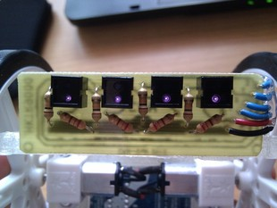

  [CNY70 sensor array for printbots](CNY70-sensor-array-for-printbots "Title")  
Creepick
--------
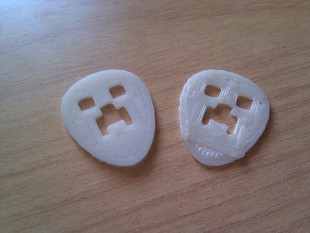

  [Creepick](Creepick "Title")  
Parametric door fix
--------
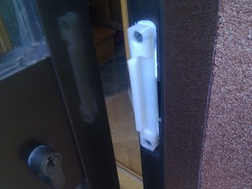

  [Parametric door fix](Parametric-door-fix "Title")  

Author: carlosgs
--------

License
--------
CC-BY-SA (unless other specified)

