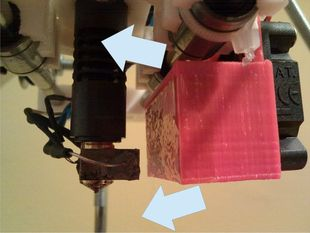

Things designed by Carlos Garcia Saura (carlosgs)
===============

**Please note: This list of things was [automatically generated](https://github.com/carlosgs/export-things). Make sure to check the individual licenses and authorships.**  
1. [RIP THINGIVERSE (+MAKERBOT + STRATASYS)](RIP-THINGIVERSE-MAKERBOT-STRATASYS/)
--------
  

2. [Customizable Lithophane](Customizable-Lithophane/)
--------
  

3. [Printrbot Spool Holder](Printrbot-Spool-Holder/)
--------
  

4. [Vector-9000, a fast line follower robot](Vector-9000-a-fast-line-follower-robot/)
--------
  

5. [Single piece peg-top! easy to print and customizable!](Single-piece-peg-top-easy-to-print-and-customizable/)
--------
  

6. [Pyramids (easy to print)](Pyramids-easy-to-print/)
--------
  

7. [Cyclone PCB Factory v0.9.7](Cyclone-PCB-Factory-v0-9-7/)
--------
  

8. [Parametric door fix](Parametric-door-fix/)
--------
  

9. [Linear actuator concept for CNC machines](Linear-actuator-concept-for-CNC-machines/)
--------
  

10. [Printable caterpillar track](Printable-caterpillar-track/)
--------
  

11. [Printed Micro-Hexapod (Plate and code)](Printed-Micro-Hexapod-Plate-and-code/)
--------
  

12. [ArduSkyBot v2.0](ArduSkyBot-v2-0/)
--------
  

13. [ArduSkyBot v1.0, an open source educational printbot](ArduSkyBot-v1-0-an-open-source-educational-printbot/)
--------
  

14. [Printshield v1.0 for Arduino printbots](Printshield-v1-0-for-Arduino-printbots/)
--------
  

15. [CNY70 sensor array for printbots](CNY70-sensor-array-for-printbots/)
--------
  

16. [Better-hinged Google Android](Better-hinged-Google-Android/)
--------
  

17. [Creepick](Creepick/)
--------
  

18. [Canon EOS 350D model](Canon-EOS-350D-model/)
--------
  

19. [Smaller Printrbot rods end hat](Smaller-Printrbot-rods-end-hat/)
--------
  

20. [Arduino based printbot HKTR-9000](Arduino-based-printbot-HKTR-9000/)
--------
  

21. [Printable NES controller](Printable-NES-controller/)
--------
  

22. [SceneBeta logo](SceneBeta-logo/)
--------
  

23. [Minimalist Shield for Arduino Printbots](Minimalist-Shield-for-Arduino-Printbots/)
--------
  

24. [Hot-end fan mount with dual air flow](Hot-end-fan-mount-with-dual-air-flow/)
--------
  

25. [Trisquel](Trisquel/)
--------
  

26. [Unicorn keychain](Unicorn-keychain/)
--------
  

  

License
--------
Please check the individual pages for each design

By: Carlos Garcia Saura (carlosgs)
--------
<http://carlosgs.es/>