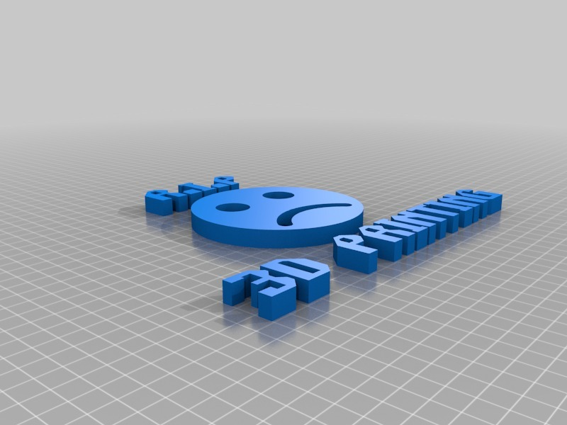

RIP THINGIVERSE (+MAKERBOT + STRATASYS)
===============

Description
--------
Now that Makerbot has been bought out by Stratasys, who's next?   
-   
The proverbial pie for consumers of 3D printing is growing larger by the day. Stratasys wants more pie.   
 
What are your thoughts on the situation?   
 
Makezine article of the lawsuit against the folks of the UP! Printer:    
-   
<a href="http://makezine.com/2013/11/27/stratasys-sues-afinia-ramifications-for-the-desktop-3d-printing-industry/" target="_blank" rel="nofollow">makezine.com/2013/11/27/stratasys-sues-afinia-ramifications-for-the-desktop-3d-printing-industry/</a>  
 
PDF of claim filed by Stratasys:    
-   
<a href="http://forums.reprap.org/file.php?1" target="_blank" rel="nofollow">forums.reprap.org/file.php?1</a>,file=21811,filename=10114908932.pdf,download=1   
 
Credit for this idea goes to **Jeremy Zimmer**   
 
I won't keep using Thingiverse and encourage yo to do the same   
-   
**There are plenty of other services now: <a href="https://www.youmagine.com/" target="_blank" rel="nofollow">youmagine.com/</a> <a href="https://cubehero.com/" target="_blank" rel="nofollow">cubehero.com/</a> <a href="http://www.bld3r.com/" target="_blank" rel="nofollow">bld3r.com/</a> <a href="http://www.fabster.com/" target="_blank" rel="nofollow">fabster.com/</a> ...**

Instructions
--------
None

Files
--------

[RIP_3DPrinting.stl](RIP_3DPrinting.stl "Title")

Pictures
--------

Author: carlosgs
--------

License
--------
CC-BY-SA (unless other specified)

