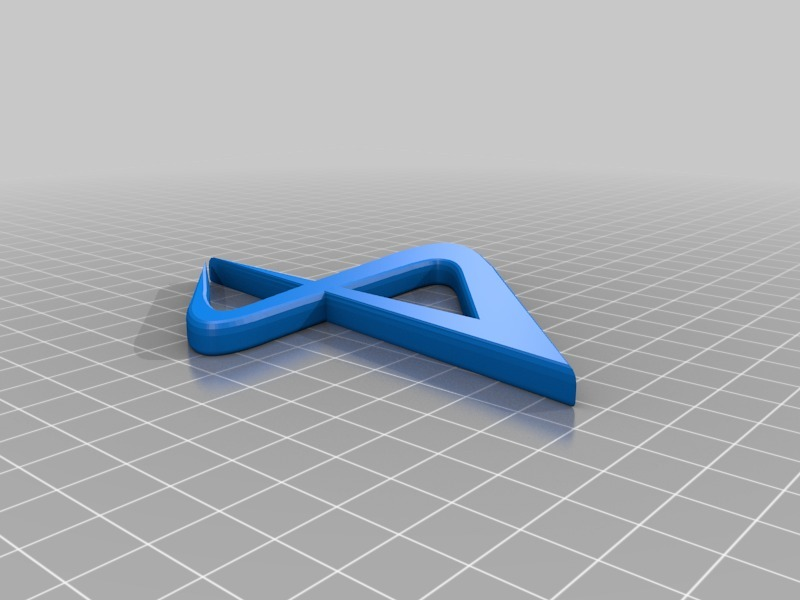

SceneBeta logo
===============
**Please note: This thing is part of a list that was [automatically generated](https://github.com/carlosgs/export-things) and may have been updated since then. Some already have [their own GitHub page!](https://github.com/carlosgs?tab=repositories) Make sure to check for the current license and authorship.**  

SceneBeta logo  by carlosgs , published May 5, 2012

Description
--------
This is the logo from the great spanish website <a href="http://www.scenebeta.com/" target="_blank" rel="nofollow">scenebeta.com/</a> 
I did not made this 3D design (only adapted it). The author is Antonio Vicente (https://twitter.com/#!/LoopinLoopin).

Instructions
--------
Download &amp; print

Files
--------

 [ logo_SB.stl](logo_SB.stl)  

Pictures
--------

Tags
--------
None  

  

License
--------
SceneBeta logo by carlosgs is licensed under the Creative Commons - Attribution - Share Alike license.  

By: Carlos Garcia Saura (carlosgs)
--------
<http://carlosgs.es/>