Single piece peg-top! easy to print and customizable!
===============
Single piece peg-top! easy to print and customizable!  by carlosgs , published Feb 13, 2013

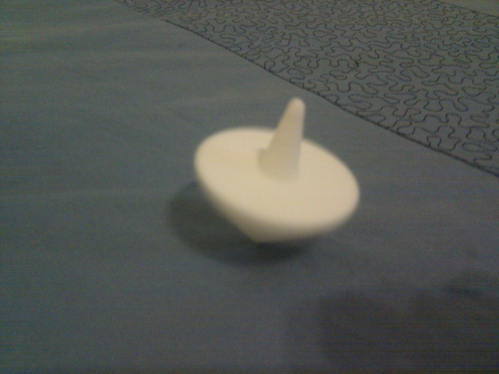

Description
--------
The title is pretty descriptive :) 
 
Printing the vertex of the top flat makes it easy to get a nice finish! 
 
No support required :) 

Instructions
--------
Download, print, spin. 
 
Important note: Keep the perimeter speed low in order to get a nice finish for the overhangs. 
 
Print settings for Cura: 0.5mm nozzle, Wall Thickness: 1.5mm, Layer Height: 0.4mm, 50% infill, 12mm/s (perimeters), 60mm/s (infill). 
These speed settings are achieved by choosing a Print Speed of 60mm/s and setting to 20% the inner/outer wall speed on the printing interface. 
 
Thank you Obijuan for fixing it!! :-)

Files
--------

 [ Spin_top_v3.scad](Spin_top_v3.scad)  

[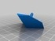](Spin_top_v3_triang.stl)
 [ Spin_top_v3_triang.stl](Spin_top_v3_triang.stl)  

 [ Spin_top.stl](Spin_top.stl)  

 [ Spin_top_v3_square.stl](Spin_top_v3_square.stl)  

 [ Spin_top_v3_pentagon.stl](Spin_top_v3_pentagon.stl)  

[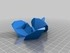](Spin_top_v3_plate.stl)
 [ Spin_top_v3_plate.stl](Spin_top_v3_plate.stl)  

Pictures
--------
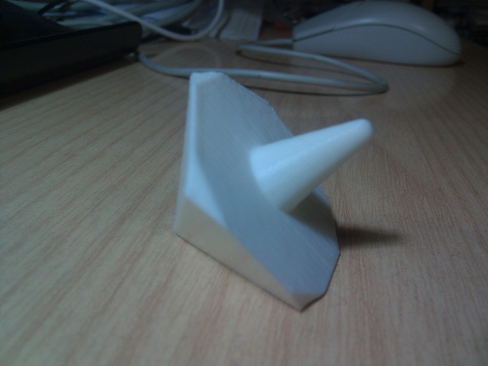
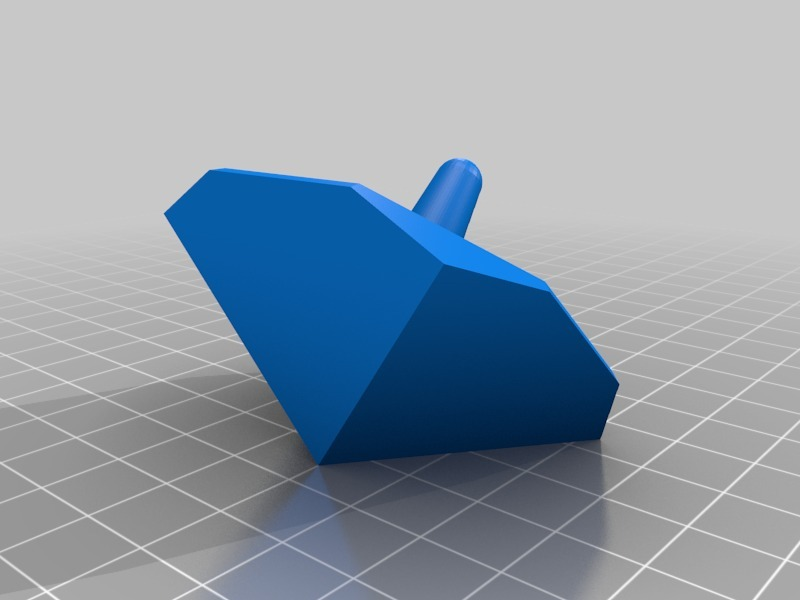
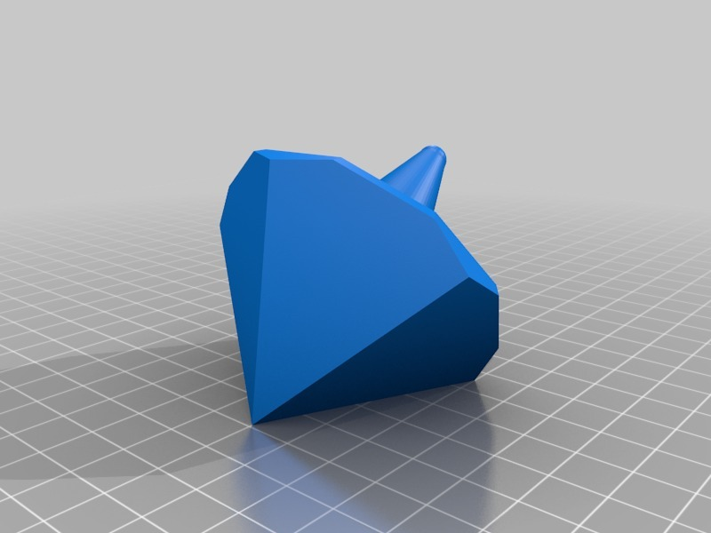
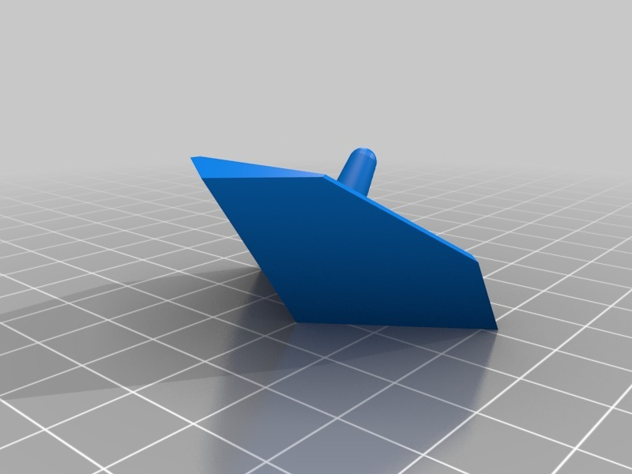
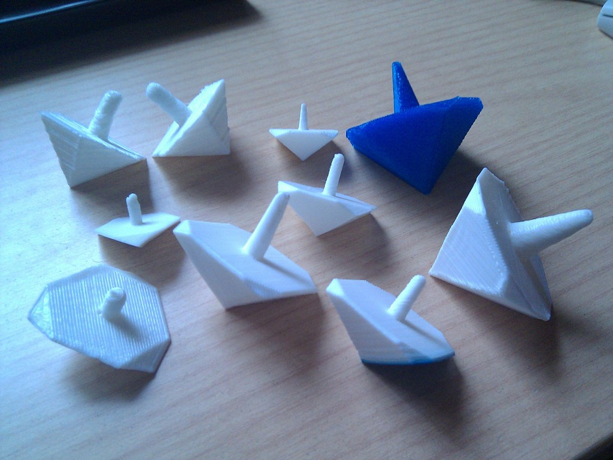
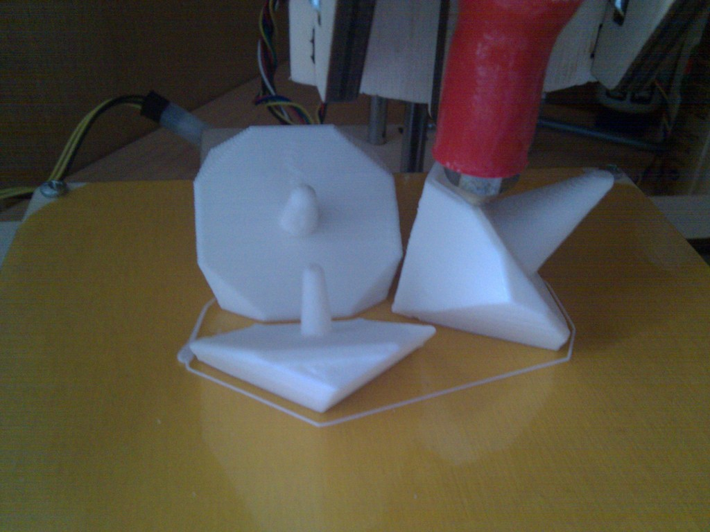
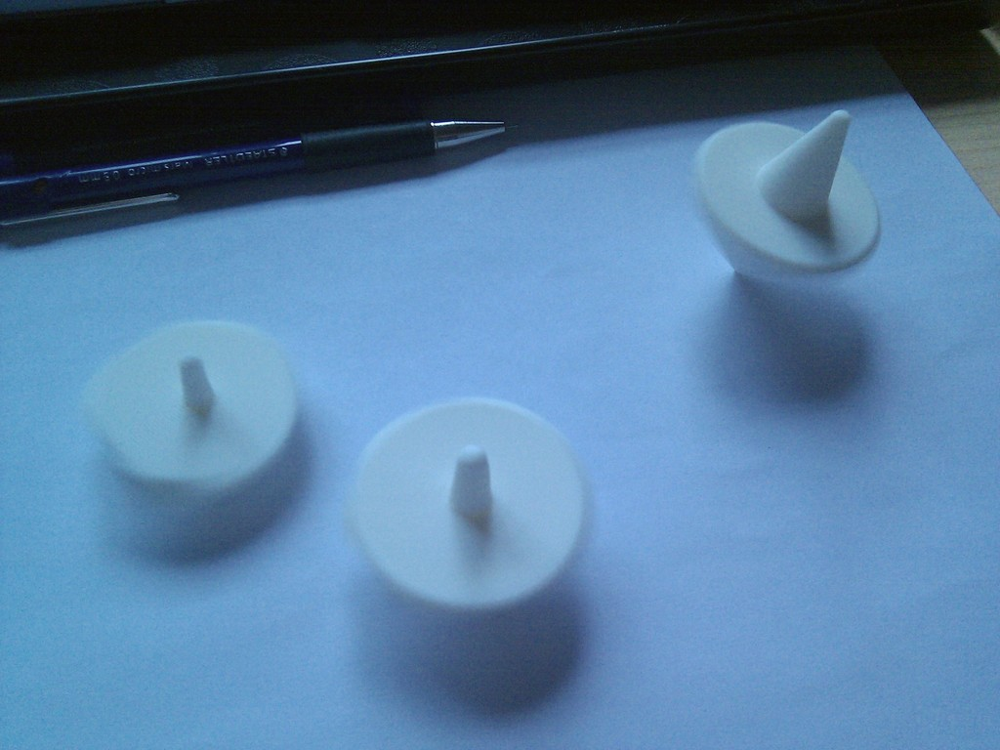
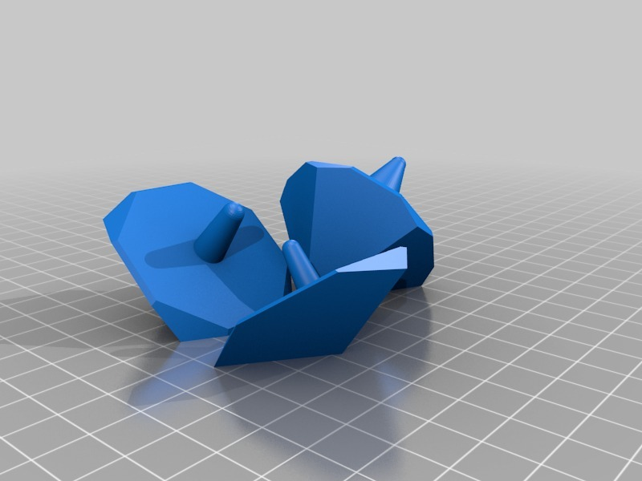

Tags
--------
customizer , customizer_challenge , openscad , peg , peg-top , peg_top , plastic_valley , simple , spin , spinner , spin_top , top , UAM  

Author: Carlos Garcia Saura (carlosgs)
--------

License
--------
Single piece peg-top! easy to print and customizable! by carlosgs is licensed under the Creative Commons - Attribution - Share Alike license.  

