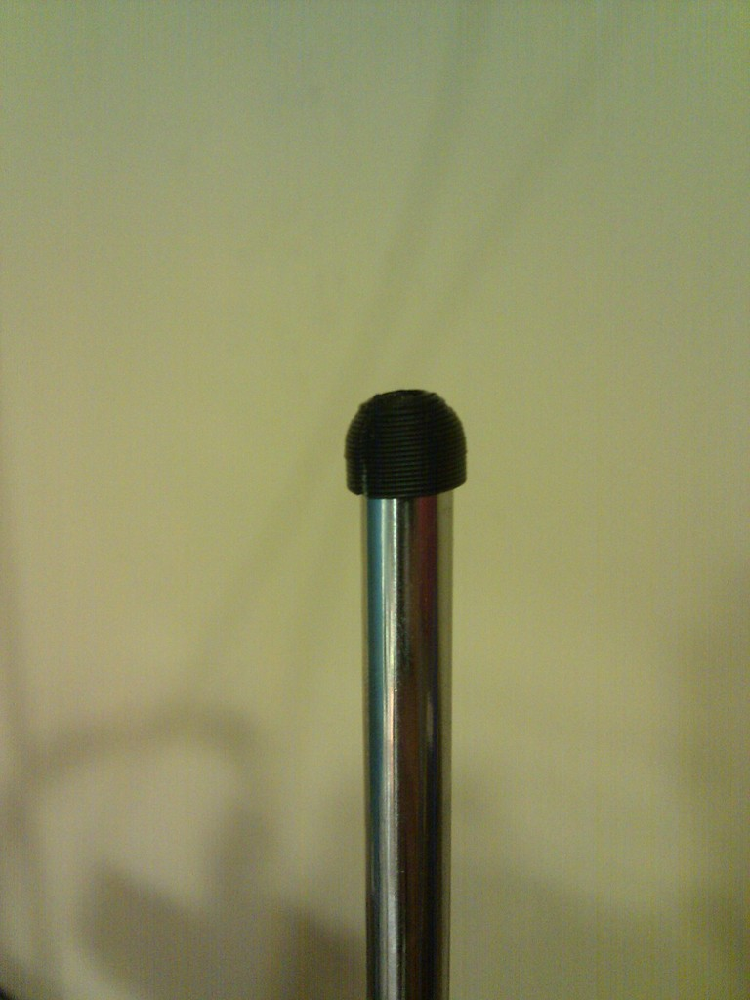

Smaller Printrbot rods end hat
===============
**Please note: This thing is part of a list that was [automatically generated](https://github.com/carlosgs/export-things) and may have been updated since then. Some already have [their own GitHub page!](https://github.com/carlosgs?tab=repositories). Make sure to check for the current license and authorship.**  

Smaller Printrbot rods end hat  by carlosgs , published Jun 21, 2012

Description
--------
I liked Siorinex's idea, but found it a bit bulky, so I made it smaller, rounded inner hole and a bit easier to parameterize. 

Instructions
--------
Print 4 &amp; fit

Files
--------

 [ Printrbot_end_hat.scad](Printrbot_end_hat.scad)  

 [ Printrbot_end_hat.stl](Printrbot_end_hat.stl)  

Pictures
--------

Tags
--------
end , hat , printrbot , rod , smooth , threaded  

  

License
--------
Smaller Printrbot rods end hat by carlosgs is licensed under the Creative Commons - Attribution - Share Alike license.  

By: Carlos Garcia Saura (carlosgs)
--------
<http://carlosgs.es/>