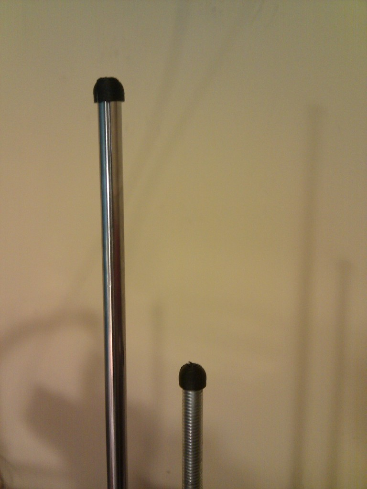
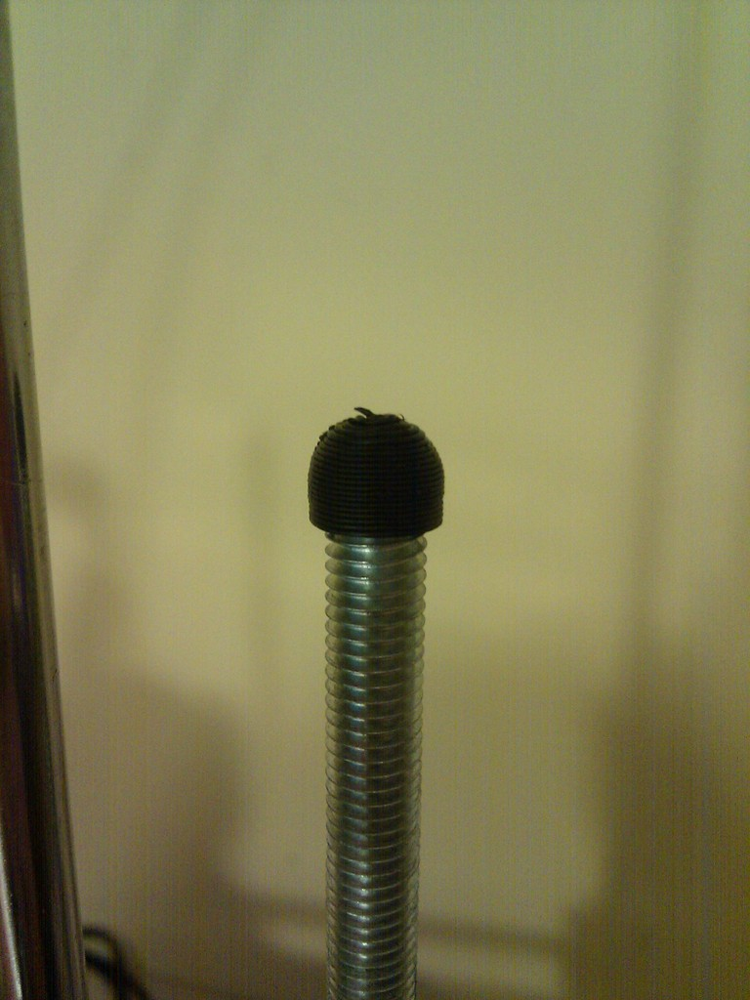
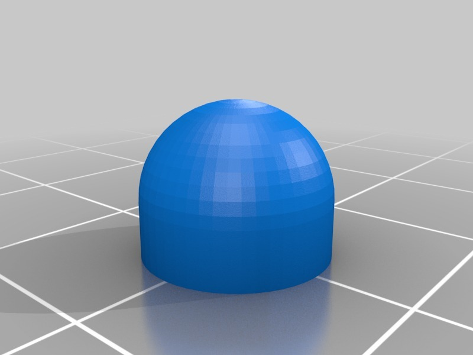

Smaller Printrbot rods end hat
===============

Description
--------
I liked Siorinex's idea, but found it a bit bulky, so I made it smaller, rounded inner hole and a bit easier to parameterize. 

Instructions
--------
Print 4 &amp; fit

Files
--------

 [ Printrbot_end_hat.scad](Printrbot_end_hat.scad "Title")  

 [ Printrbot_end_hat.stl](Printrbot_end_hat.stl "Title")  

Pictures
--------

Author: carlosgs
--------

License
--------
CC-BY-SA (unless other specified)

