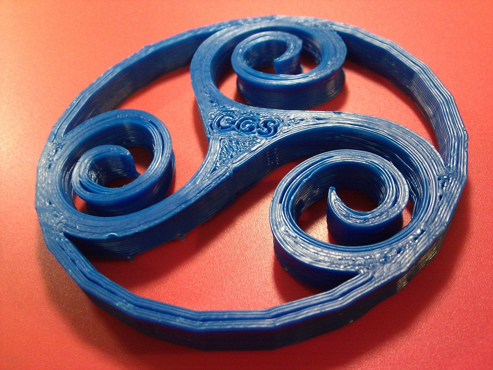
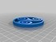
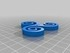
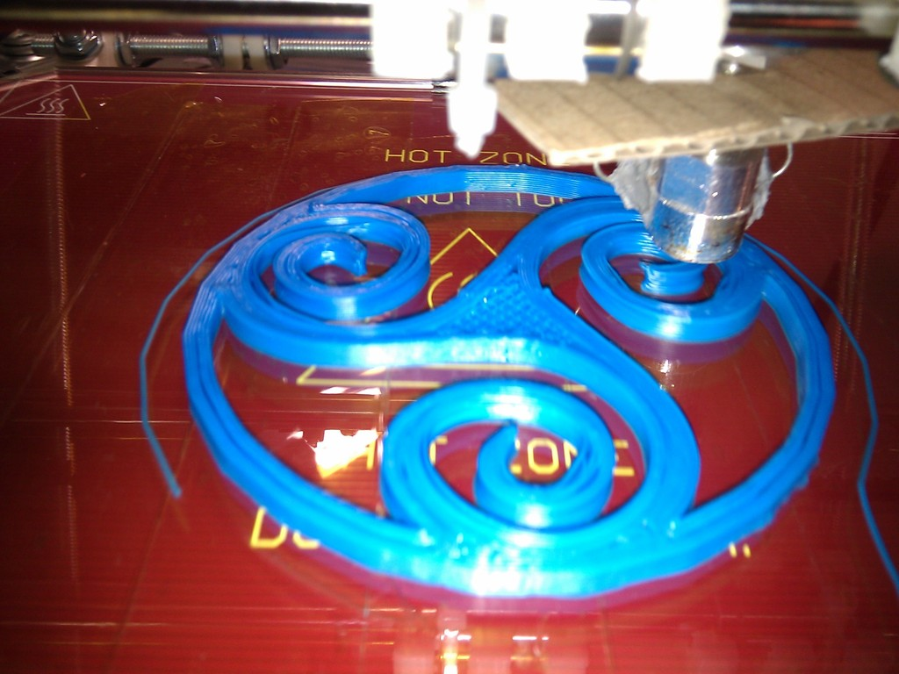
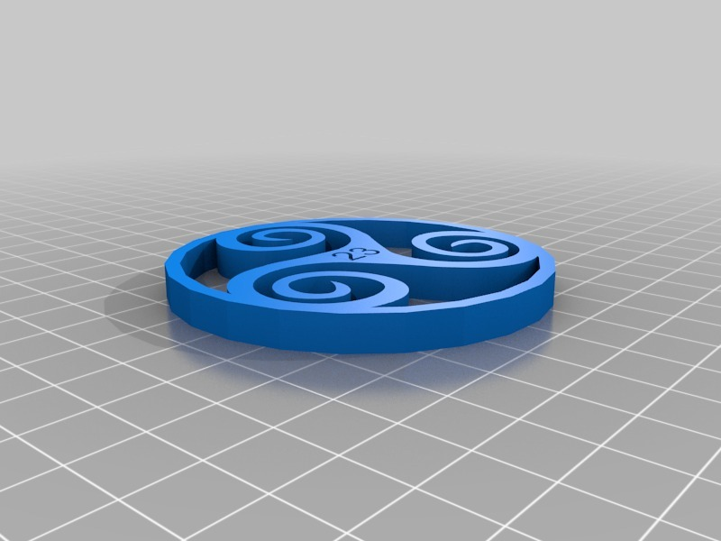
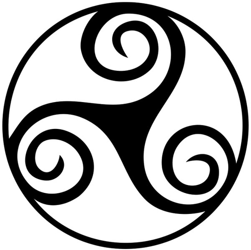
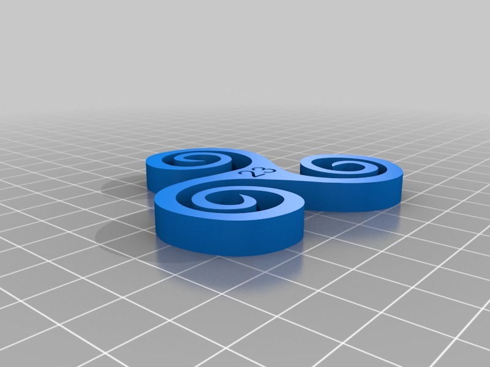

Trisquel
===============
**Please note: This thing is part of a list that was [automatically generated](https://github.com/carlosgs/export-things) and may have been updated since then. Some already have [their own GitHub page!](https://github.com/carlosgs?tab=repositories) Make sure to check for the current license and authorship.**  

Trisquel  by carlosgs , published Apr 6, 2012

Description
--------
Trisquel celtic symbol with number 23 and CGS on both sides.

Instructions
--------
I designed this in Sketchup (sorry..) as a request from a friend. If someone knows how to create the same shape with OpenScad directly from an image, I would like to learn how to do that :)

Files
--------

 [ trisquel_circ_3d.skp](trisquel_circ_3d.skp)  

 [ trisquelcirclogo3d_fixed.stl](trisquelcirclogo3d_fixed.stl)  

 [ trisquel_3d.stl](trisquel_3d.stl)  

 [ trisquel_3d.skp](trisquel_3d.skp)  

Pictures
--------

Tags
--------
23 , 3D , celtic , CGS , plastic_valley , sketchup , trisquel , UAM  

  

License
--------
Trisquel by carlosgs is licensed under the Creative Commons - Attribution - Share Alike license.  

By: Carlos Garcia Saura (carlosgs)
--------
<http://carlosgs.es/>