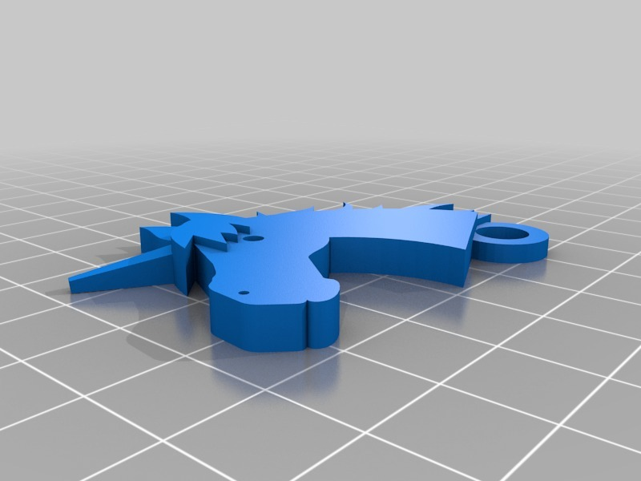
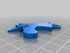
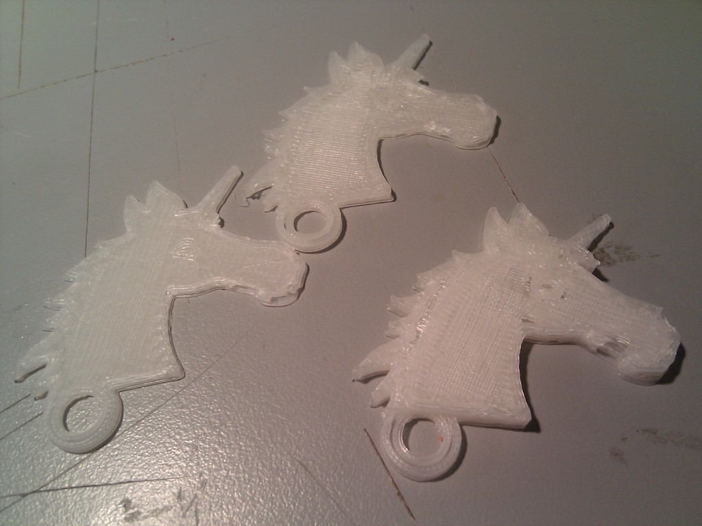
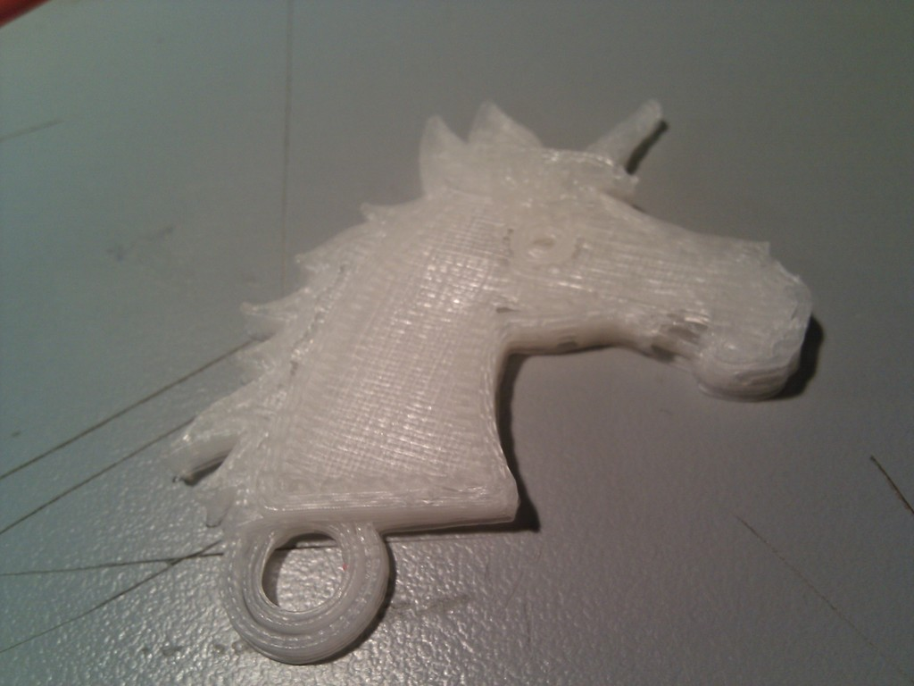
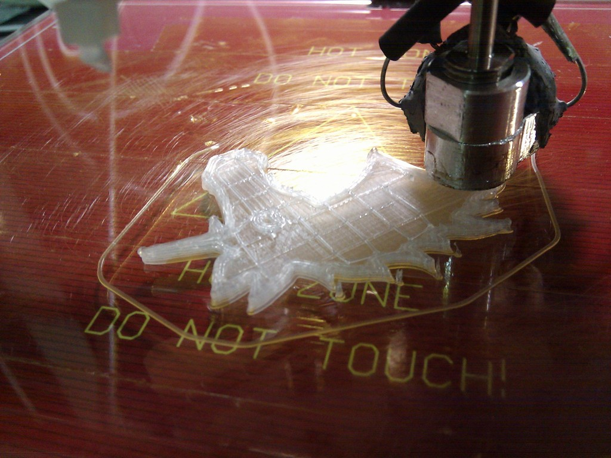
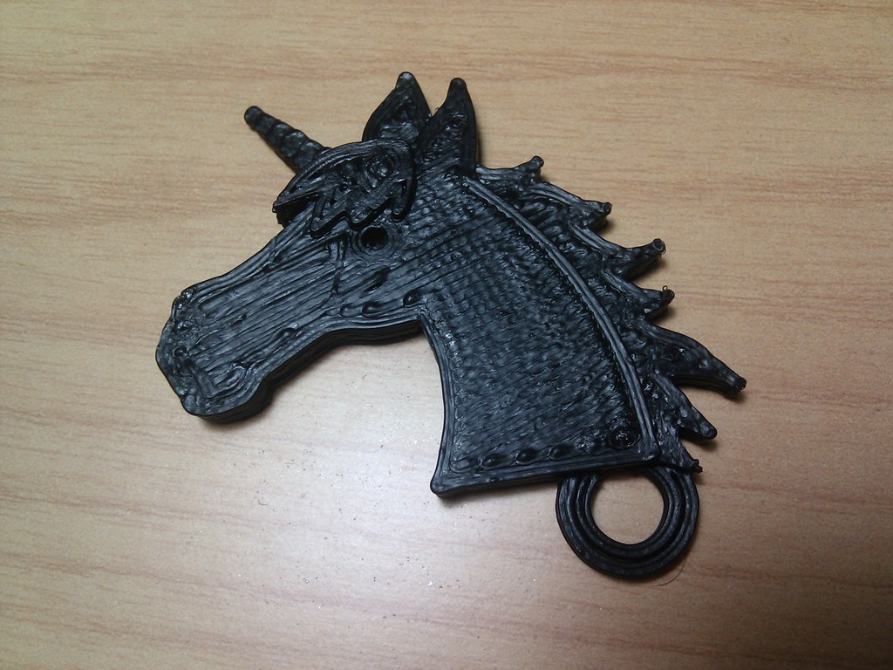

Unicorn keychain
===============
**Please note: This list has been automatically generated. Some of the designs have been updated since then, and already have they own GitHub page.**  

Unicorn keychain  by carlosgs , published Mar 8, 2012

Description
--------
A friend of mine asked me for a unicorn keychain. I saw the horse design (thing:8308) and quickly added a horn with OpenScad. 
My .scad code is rubbish, I warn you. It uses the .stl model of the original design and adds a squared horn. 
You can use the .stl directly :)

Instructions
--------
Download and print.

Files
--------

 [ unicorn.stl](unicorn.stl)  

 [ unicorn.scad](unicorn.scad)  

Pictures
--------

Tags
--------
keychain , plastic_valley , UAM , unicorn  

Author: Carlos Garcia Saura (carlosgs)
--------
<http://carlosgs.es/>  

License
--------
Unicorn keychain by carlosgs is licensed under the Creative Commons - Attribution - Share Alike license.  

