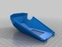
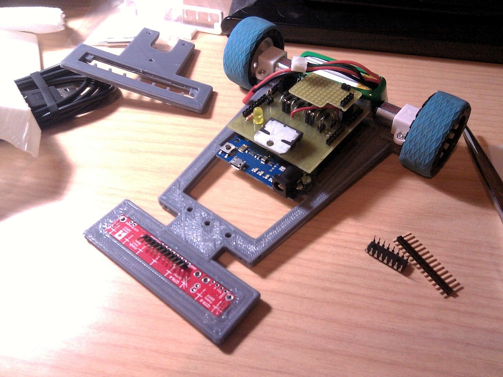

Vector-9000, a fast line follower robot
===============

Description
--------
By Carlosgs and Víctor Uceda. 
 
This robot was designed and built two weeks ahead the Cosmobot competition (http://www.roboticspot.com/cosmobot/). 

Instructions
--------
More info coming soon. 
 
Video: <a href="http://www.youtube.com/watch?v=wgSMBDEtGO0" target="_blank" rel="nofollow">youtube.com/watch?v=wgSMBDEtGO0</a> 
 
Tech specs: 
 - Arduino Leonardo with CRM Shield + MUX + lots of wire-wrapping 
 - Pololu QTR-8A (RC) and CNY-70 line sensor boards 
 - 7.4V Li-Po battery 
 - LDR sensor array (x4) as an experiment to determine the robot's orientation

Files
--------

 [ Chasis.scad](Chasis.scad "Title")  

 [ Chasis.stl](Chasis.stl "Title")  

 [ CubiertaCarcasa.stl](CubiertaCarcasa.stl "Title")  

 [ NuevaCover.stl](NuevaCover.stl "Title")  

 [ CubiertaPololu.stl](CubiertaPololu.stl "Title")  

 [ CubiertaPololu.scad](CubiertaPololu.scad "Title")  

 [ LineSensorV2_new.scad](LineSensorV2_new.scad "Title")  

 [ TercerApoyo.stl](TercerApoyo.stl "Title")  

 [ TercerApoyo.scad](TercerApoyo.scad "Title")  

 [ CubiertaCarcasa.scad](CubiertaCarcasa.scad "Title")  

 [ SoporteLDR.stl](SoporteLDR.stl "Title")  

 [ SoporteLDR.scad](SoporteLDR.scad "Title")  

Pictures
--------

Author: carlosgs
--------

License
--------
CC-BY-SA (unless other specified)

