Vector-9000, a fast line follower robot
===============
**Please note: This thing is part of a list that was [automatically generated](https://github.com/carlosgs/export-things) and may have been updated since then. Make sure to check for the current license and authorship.**  

Vector-9000, a fast line follower robot  by carlosgs , published Mar 23, 2013

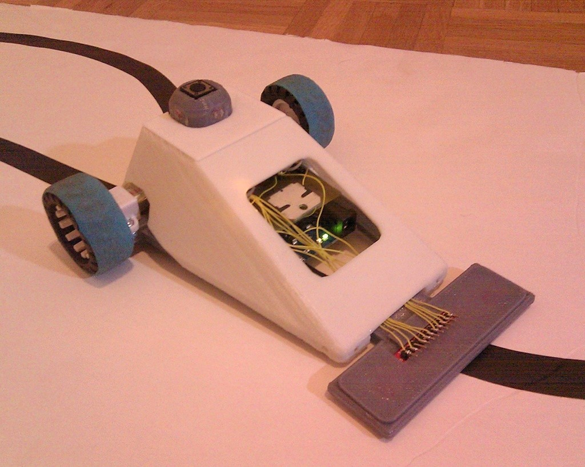

Description
--------
By Carlosgs and Vctor Uceda. 
 
This robot was designed and built two weeks ahead the Cosmobot competition (http://www.roboticspot.com/cosmobot/). 

Instructions
--------
More info coming soon. 
 
Video: <a href="http://www.youtube.com/watch?v=wgSMBDEtGO0" target="_blank" rel="nofollow">youtube.com/watch?v=wgSMBDEtGO0</a> 
 
Tech specs: 
 - Arduino Leonardo with CRM Shield + MUX + lots of wire-wrapping 
 - Pololu QTR-8A (RC) and CNY-70 line sensor boards 
 - 7.4V Li-Po battery 
 - LDR sensor array (x4) as an experiment to determine the robot's orientation

Files
--------
[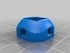](SoporteLDR.stl)
 [ SoporteLDR.stl](SoporteLDR.stl)  

 [ TercerApoyo.stl](TercerApoyo.stl)  

[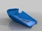](NuevaCover.stl)
 [ NuevaCover.stl](NuevaCover.stl)  

 [ Chasis.stl](Chasis.stl)  

[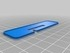](CubiertaPololu.stl)
 [ CubiertaPololu.stl](CubiertaPololu.stl)  

 [ TercerApoyo.scad](TercerApoyo.scad)  

 [ LineSensorV2_new.scad](LineSensorV2_new.scad)  

 [ CubiertaPololu.scad](CubiertaPololu.scad)  

 [ CubiertaCarcasa.scad](CubiertaCarcasa.scad)  

 [ Chasis.scad](Chasis.scad)  

[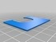](CubiertaCarcasa.stl)
 [ CubiertaCarcasa.stl](CubiertaCarcasa.stl)  

 [ SoporteLDR.scad](SoporteLDR.scad)  

Pictures
--------
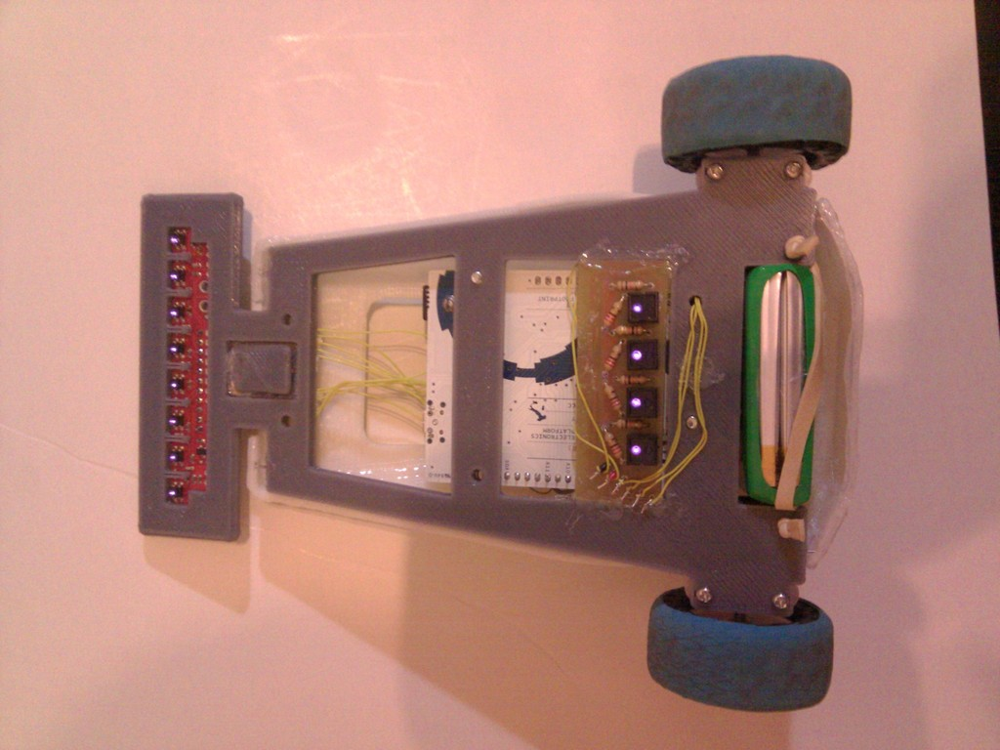
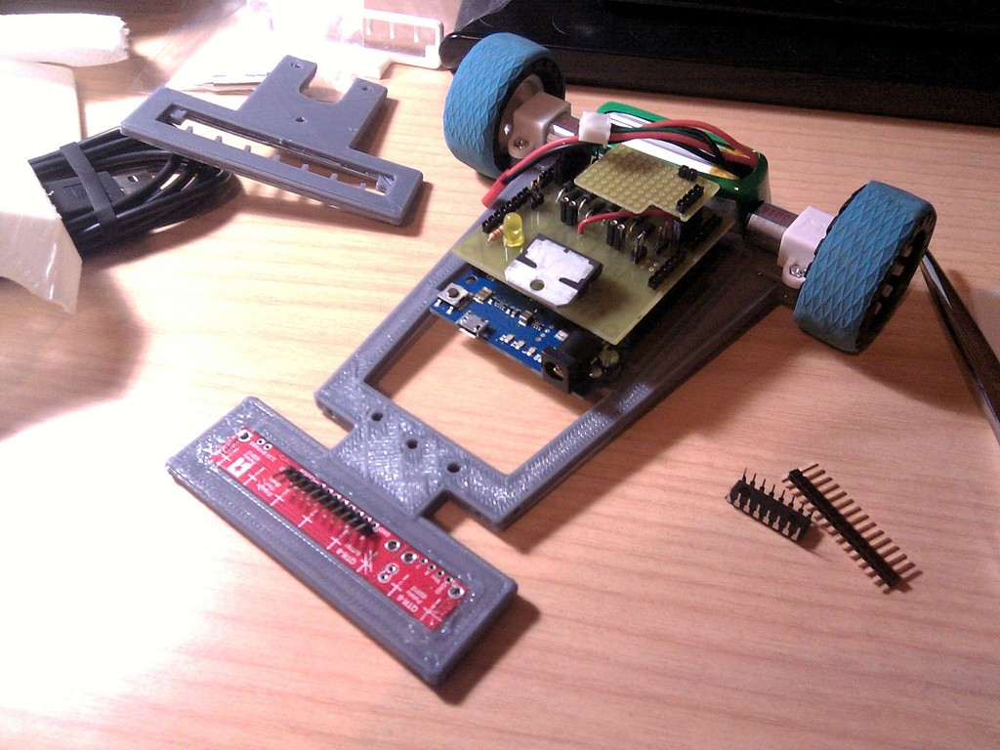
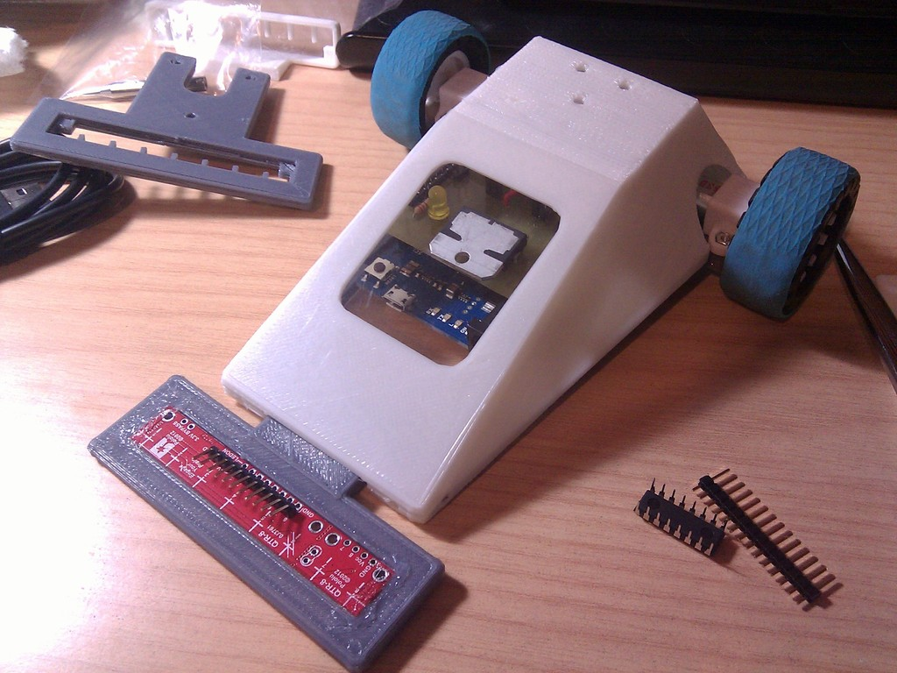
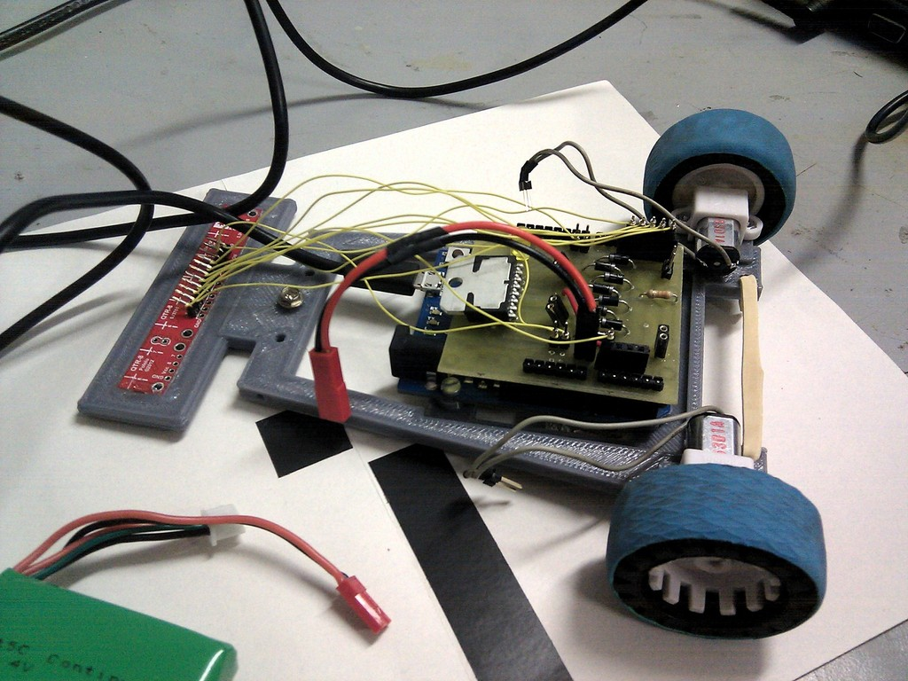
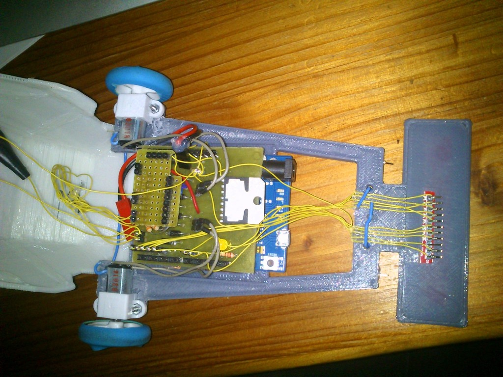
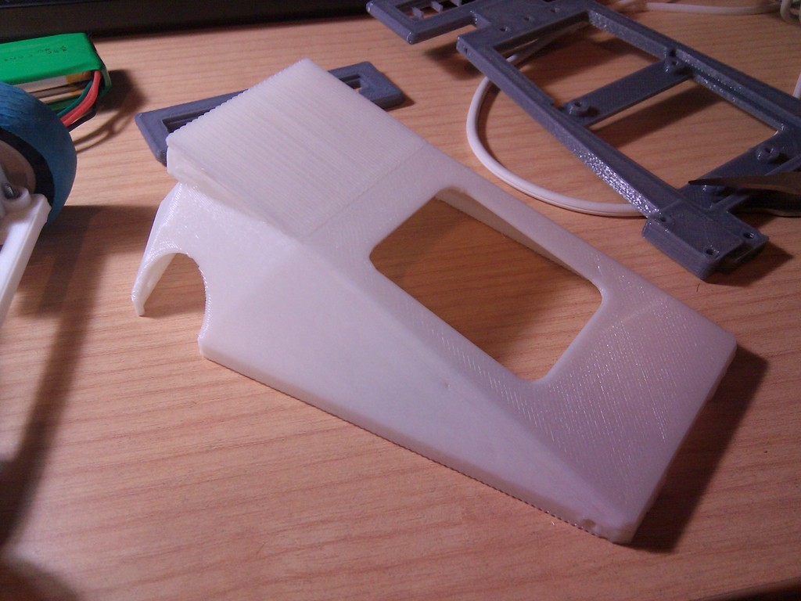
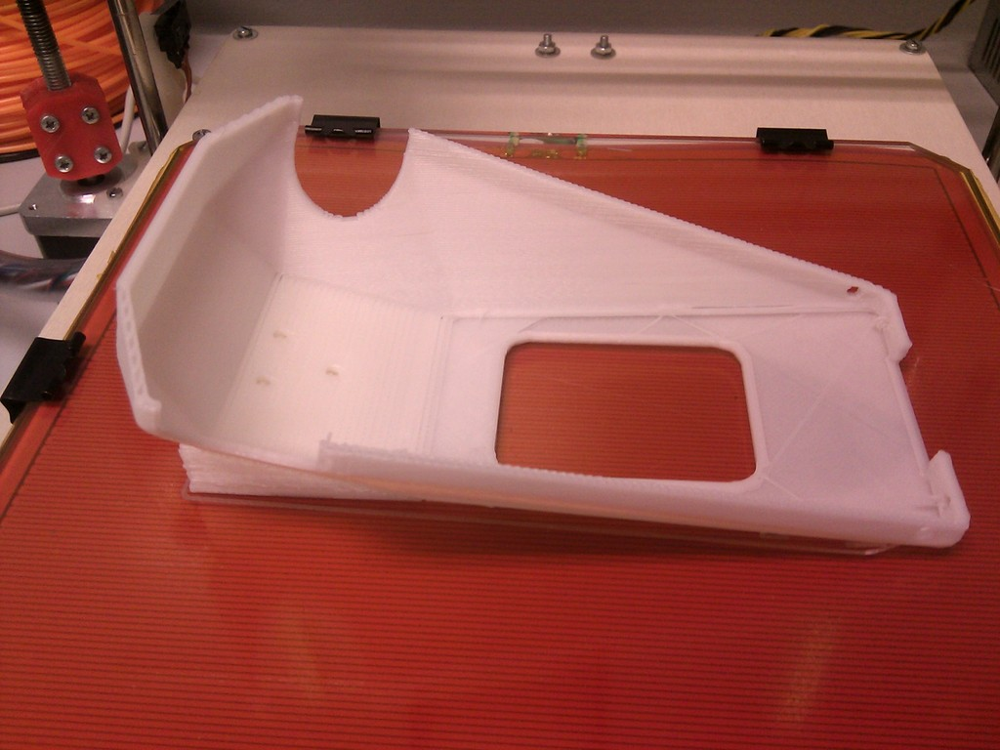
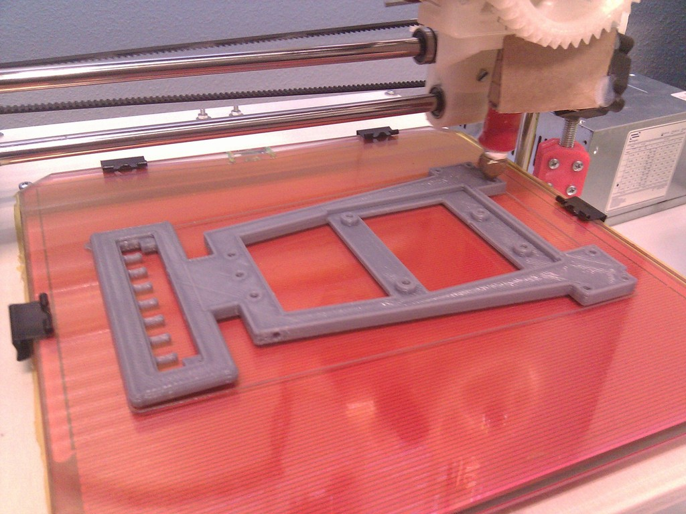
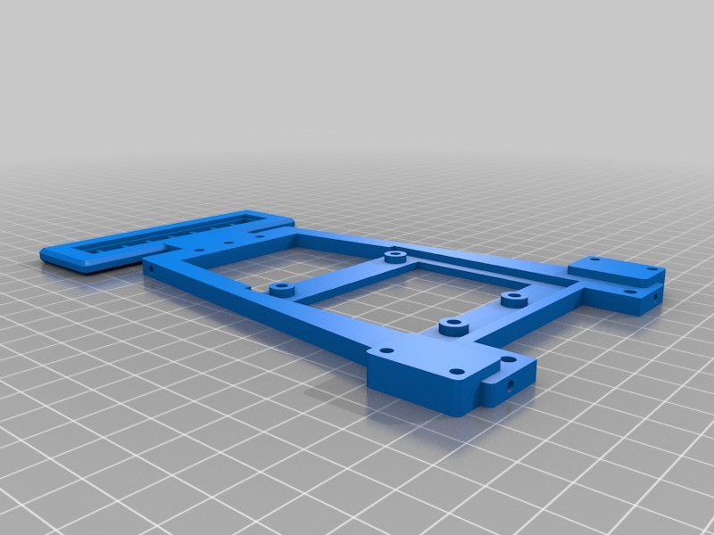

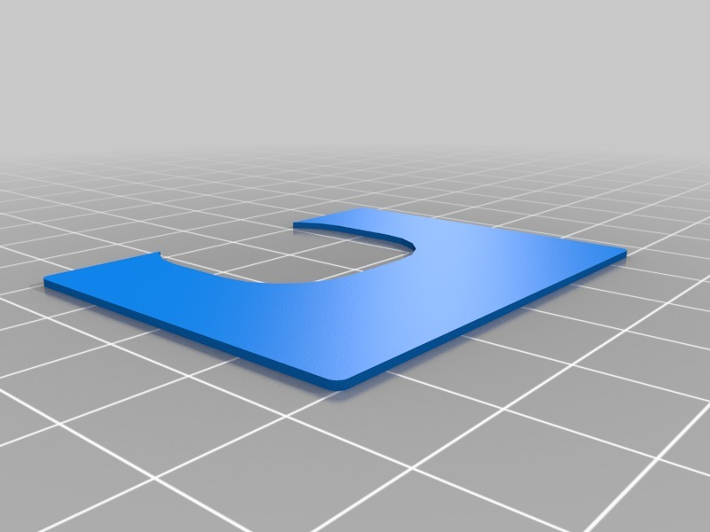
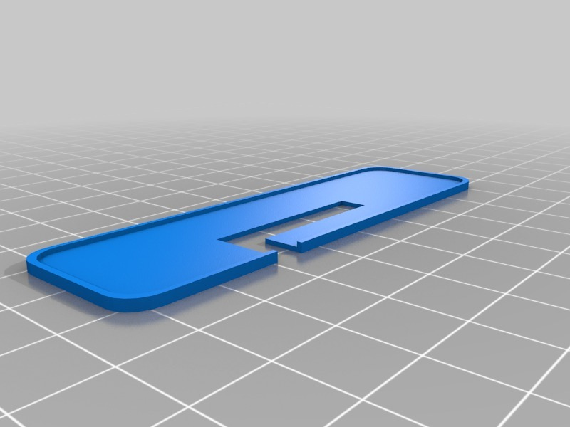

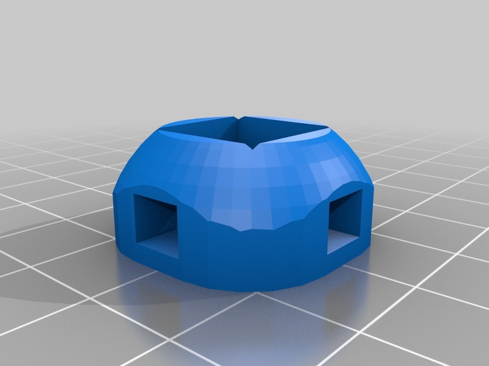

Tags
--------
ARDUINO , CRM , PLASTIC_VALLEY , PRINTBOT , SHIELD , UAM  

  

License
--------
Vector-9000, a fast line follower robot by carlosgs is licensed under the Creative Commons - Attribution - Share Alike license.  

By: Carlos Garcia Saura (carlosgs)
--------
<http://carlosgs.es/>